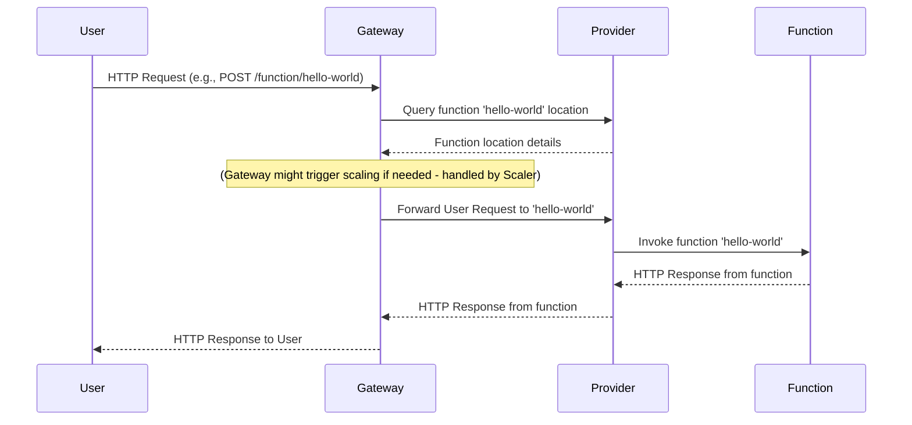

# Chapter 1: Gateway Application

Welcome to the OpenFaaS tutorial! In this first chapter, we'll explore the **Gateway Application**. Think of the Gateway as the central entry point for everything happening in your OpenFaaS deployment.

## What Problem Does the Gateway Solve?

Imagine you have several small programs (your "functions") that can do different tasks, like processing an image, sending an email, or fetching data. These functions might be running on different servers or in different containers. How does someone (or another program) send a request to the *correct* function without knowing exactly where it lives or how to start it if it's not running?

This is where the **Gateway** comes in. It acts like a helpful receptionist or a post office for your functions. It's the single address you interact with. You send your request to the Gateway, telling it *which* function you want to use, and the Gateway figures out all the details to get your request to the right place and return the response to you.

**Central Use Case:** A common task is simply calling a function by its name using a web request (HTTP). For example, you might want to call a function named `hello-world` to get a simple greeting.

## What is the Gateway?

The Gateway Application is the heart of an OpenFaaS deployment. It's a single process that runs and handles all incoming requests related to managing or invoking your functions.

Here's what it primarily does:

1.  **Receives Requests:** It listens for HTTP requests from users, clients, or other systems.
2.  **Routing:** It looks at the incoming request (especially the URL path) and decides what needs to be done. Is it a request to run a function? To list all functions? To deploy a new one?
3.  **Coordination:** It talks to other components in the OpenFaaS system, like the "Provider" (which knows where your functions are running and how to start/stop them), "Scalers" (which decide if a function needs more instances), and "Notifiers" (which might log or report things happening).
4.  **Forwarding:** For function invocation requests, it forwards the request to the actual function instance.
5.  **Response Handling:** It receives the response from the function and sends it back to the original requestor.

Think of the Gateway like the main switchboard or the front desk of a large office building. All calls (requests) come to the switchboard (Gateway). The operator (Gateway) identifies who the call is for (which function) and connects the caller to the right person (forwards the request to the function).

## How Does the Gateway Solve Our Use Case?

Let's take our simple use case: calling the `hello-world` function via HTTP.

1.  **You** make an HTTP request to the Gateway's address, let's say `gateway.openfaas.example.com:8080`.
2.  You specify the function you want to call, often in the path, like `/function/hello-world`.
3.  The **Gateway** receives the request.
4.  It sees the path `/function/hello-world`.
5.  Based on its routing rules, it understands this means "invoke the function named `hello-world`".
6.  The Gateway then talks to the OpenFaaS **Provider** (which we'll cover later in [Provider Interaction](07_provider_interaction_.md)) to find or potentially start the `hello-world` function.
7.  The Gateway forwards your request to the function instance provided by the Provider.
8.  The `hello-world` function runs and sends a response back to the Provider.
9.  The Provider sends the response back to the Gateway.
10. The Gateway sends the response back to you.

This makes it easy for you! You only need to know the Gateway's address and the name of the function. The Gateway handles the rest of the complexity.

Here's a simplified sequence of events for invoking a function:



*Note: The diagram simplifies the interaction. The Gateway interacts with the Provider to get the function's address, and then typically forwards the request directly to that function's address, which is managed by the Provider.*

## Gateway's Internal Implementation (Simplified)

Let's look at the core of the Gateway application using snippets from the `gateway/main.go` file.

The Gateway is essentially a web server built using the Go programming language and the `gorilla/mux` library for handling different URL routes.

### Setting up the Server

The `main` function is the entry point. It first reads configuration, initializes various components, sets up routing, and then starts listening for HTTP requests.

```go
func main() {
	// Read configuration settings for the gateway
	osEnv := types.OsEnv{}
	readConfig := types.ReadConfig{}
	config, configErr := readConfig.Read(osEnv)

	if configErr != nil {
		log.Fatalln(configErr) // Stop if configuration fails
	}

	// ... initialization of handlers, scalers, etc. ...

	// Create a new router to define URL paths
	r := mux.NewRouter()

	// ... define various routes ...

	// Start the HTTP server, listening on a specific port
	tcpPort := 8080
	s := &http.Server{
		Addr:           fmt.Sprintf(":%d", tcpPort),
		ReadTimeout:    config.ReadTimeout,
		WriteTimeout:   config.WriteTimeout,
		MaxHeaderBytes: http.DefaultMaxHeaderBytes,
		Handler:        r, // Use the configured router to handle requests
	}

	log.Fatal(s.ListenAndServe()) // Start the server and block until it stops
}
```

**Explanation:**

*   The code starts by reading necessary settings (like timeouts, provider URL) using `readConfig`. We'll dive into these settings in the next chapter, [Configuration](02_configuration_.md).
*   `mux.NewRouter()` creates an object (`r`) that helps us map specific URL paths (like `/function/hello-world`) to specific pieces of code (called "handlers") that will process requests for those paths.
*   After setting up the routes (which we'll see next), it creates an `http.Server` object (`s`).
*   `s.ListenAndServe()` starts the web server, making the Gateway available to receive requests on port 8080.

### Defining Routes

The router (`r`) is then used to define which **handler** (the code that processes a request) should be executed for which URL path.

```go
	// Initialize various handlers for different tasks
	var faasHandlers types.HandlerSet
	// ... initialization code for faasHandlers ...

	// Assign the handler for function invocation
	functionProxy := faasHandlers.Proxy

	// ... logic for async handling or scaling ...

	// Define routes for synchronous function calls
	r.HandleFunc("/function/{name:["+NameExpression+"]+}", functionProxy)
	r.HandleFunc("/function/{name:["+NameExpression+"]+}/", functionProxy)
	r.HandleFunc("/function/{name:["+NameExpression+"]+}/{params:.*}", functionProxy)

	// Define routes for system operations (like listing functions)
	r.HandleFunc("/system/functions", faasHandlers.ListFunctions).Methods(http.MethodGet)
	r.HandleFunc("/system/functions", faasHandlers.DeployFunction).Methods(http.MethodPost)
	r.HandleFunc("/system/functions", faasHandlers.DeleteFunction).Methods(http.MethodDelete)
	// ... many other system routes ...
```

**Explanation:**

*   `faasHandlers` is a structure holding different handler functions, each responsible for a specific API endpoint or function (like proxying requests, listing functions, etc.). We'll explore handlers more in [Request Handling (Sync/Async)](05_request_handling__sync_async__.md).
*   `r.HandleFunc(...)` is how routes are defined.
    *   The first argument is the URL path pattern. Notice patterns like `/function/{name:...}` which capture the function name from the URL.
    *   The second argument is the `http.HandlerFunc` (or a function that behaves like one) that will be called when a request matches this path.
*   The routes `/function/...` are handled by `functionProxy`, which is responsible for forwarding requests to individual functions.
*   Routes like `/system/functions` are used for managing functions themselves (deploying, listing, deleting) and are handled by different handlers from `faasHandlers`.

This routing setup is how the Gateway knows, for example, that a request to `/function/hello-world` means it should use the `functionProxy` handler, and a request to `/system/functions` with a `GET` method should use the `ListFunctions` handler.

## Conclusion

The Gateway Application is the essential front door of your OpenFaaS system. It receives all requests, uses routing to understand their purpose, and coordinates with other OpenFaaS components like the Provider and Scalers to ensure requests are handled correctly, whether it's invoking a function or performing a system operation. By interacting only with the Gateway, users and clients are abstracted away from the complexities of finding and managing individual function instances.

Now that we understand the Gateway's role as the central hub, let's look at how it gets configured and learns about settings like timeouts and the location of the Provider.

[Chapter 2: Configuration](02_configuration_.md)

---

<sub><sup>Generated by [AI Codebase Knowledge Builder](https://github.com/The-Pocket/Tutorial-Codebase-Knowledge).</sup></sub> <sub><sup>**References**: [[1]](https://github.com/openfaas/faas/blob/7803ea1861f2a22adcbcfa8c79ed539bc6506d5b/gateway/main.go)</sup></sub>
