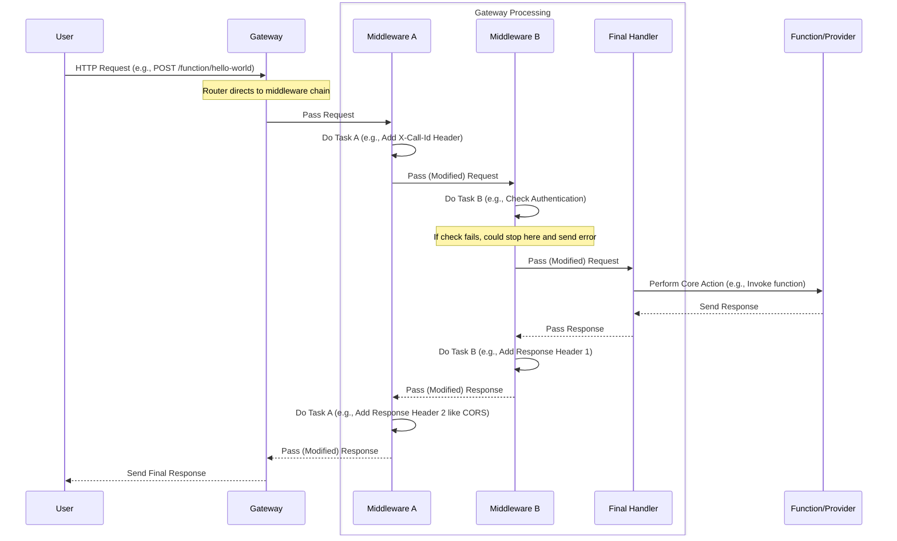

# Chapter 4: Request Middleware

Welcome back! In [Chapter 3: API Definition](03_api_definition_.md), we learned how the OpenFaaS Gateway defines the specific paths and methods you use to interact with it, like sending a `POST` request to `/function/hello-world` to invoke your function. The Gateway uses a router to figure out which piece of code (which "handler") should process that specific request.

But what happens *between* the moment the Gateway receives the request and the moment it actually starts running the code responsible for, say, invoking the function? This is where **Request Middleware** comes in.

## What Problem Does Request Middleware Solve?

Imagine you have multiple types of requests hitting the Gateway: invoking `hello-world`, invoking `process-image`, deploying a *new* function, listing existing functions. For each of these requests, the Gateway has a specific "handler" function responsible for the core task (invoke, deploy, list, etc.).

Now, consider tasks that apply to *many* or *all* of these requests:

*   **Tracing:** How do you track a single request's journey through the system? You need a unique ID assigned early on.
*   **Security:** Does the user have permission to make this request? Do they need to provide credentials?
*   **Logging:** Recording that a request happened, regardless of *which* function it called or *what* system operation it performed.
*   **Cross-Origin Resource Sharing (CORS):** If a web page in a browser is calling your Gateway API, the browser enforces security rules that require specific headers in the response. These headers need to be added to *any* API response the browser might receive.
*   **Preparing Data:** Maybe you need to add some standard headers or inject specific authentication details *into* the request before it's forwarded elsewhere (like to the Provider or the function itself).

Doing these tasks *inside* each and every individual handler (the invoke handler, the deploy handler, the list handler, etc.) would be incredibly repetitive. It makes the code harder to write, maintain, and update.

This is exactly the problem **Request Middleware** solves.

**Central Use Case:** For our goal of invoking `hello-world`, we might want to automatically add a unique "Call ID" to the request as it enters the Gateway. This ID can then be logged and potentially passed along, helping us trace the request through the system if something goes wrong. We also want to ensure that if a web browser calls the Gateway to list functions or invoke one, the response includes the necessary CORS headers so the browser doesn't block it. Middleware handles these cross-cutting tasks *before* the function invocation logic even starts.

## What is Request Middleware?

Request Middleware components are like checkpoints or preparation stations that sit *in between* the Gateway's router and the final handler that does the main work.

Think of the Gateway's request processing pipeline like an assembly line, or perhaps better, like passing a letter through several offices before it reaches its final recipient:

1.  The letter (Request) arrives at the main mailroom (Router).
2.  The mailroom identifies the recipient (the specific Handler based on the [API Definition](03_api_definition_.md)).
3.  BUT, before sending it *directly* to the recipient, the mailroom first sends it to the "Security Check" office (Middleware 1).
4.  The Security Check office checks for forbidden items, perhaps stamps it with a unique tracking number, and then passes it to the "Header Attaching" office (Middleware 2).
5.  The Header Attaching office adds necessary official stamps (like a "Processed" stamp or the Call ID). Then it passes it to the "Final Recipient" office (the actual Handler).
6.  The Final Recipient processes the letter (runs the function, lists functions, etc.).
7.  The response (Processed Letter) travels *back* through the same offices in reverse (Header Attaching, Security Check), where they might add stamps to the envelope (response headers like CORS).
8.  Finally, the response leaves the mailroom.

Each "office" in this analogy is a piece of **middleware**. Middleware wraps the next step in the chain. It receives the request, does its specific task (or checks something), and then explicitly passes the request (or a modified version of it) to the next piece of middleware or the final handler.

This structure is often called a "middleware chain" or "middleware pipeline".



*Note: The diagram simplifies the Gateway as a single box, but shows the internal flow through different middleware components before reaching the core "Final Handler" which then interacts with external services like the Function/Provider.*

Middleware makes the code modular: each middleware component does one thing well (like adding a Call ID, handling CORS). You can compose these components like Lego bricks, applying different middleware chains to different sets of handlers if needed, or applying the same middleware to *all* handlers easily.

## How Middleware Solves Our Use Case

Let's revisit our use case: adding a unique Call ID and ensuring CORS headers for the `hello-world` invocation.

1.  **Call ID Middleware:** A specific middleware component is created whose job is, upon receiving a request, to check if an `X-Call-Id` header already exists. If not, it generates a new, unique ID (like a UUID) and adds it to both the incoming request's headers and the outgoing response's headers. Then, it passes the request down the chain.
2.  **CORS Middleware:** Another middleware component is responsible for setting specific response headers like `Access-Control-Allow-Origin`, `Access-Control-Allow-Headers`, etc. This middleware typically runs *after* the main handler has generated a response, adding these headers before the response is sent back to the client.

When you send your `POST /function/hello-world` request to the Gateway:
*   The router matches the path to the `functionProxy` handler (from [Chapter 3: API Definition](03_api_definition_.md)).
*   But `functionProxy` isn't called directly. Instead, the router calls the *first* middleware in the chain configured for this route.
*   The Call ID middleware runs, adds the `X-Call-Id` header to the request, and calls the next middleware.
*   (Other middleware, potentially auth, might run here).
*   Eventually, the request reaches the `functionProxy` handler, which uses the now-modified request (with the Call ID) to interact with the Provider and invoke `hello-world` (as discussed in [Chapter 5: Request Handling (Sync/Async)](05_request_handling__sync_async__.md) and [Chapter 7: Provider Interaction](07_provider_interaction_.md)).
*   The `functionProxy` handler gets the response from `hello-world`.
*   The response travels back up the middleware chain.
*   The CORS middleware intercepts the response and adds the required `Access-Control-*` headers.
*   The Call ID middleware (running again on the response path) confirms the `X-Call-Id` header is set on the response.
*   The final response, now with the Call ID and CORS headers, is sent back to you.

This happens automatically for every request that goes through this middleware chain, achieving the desired cross-cutting functionality without cluttering the main function invocation logic.

## Gateway's Internal Implementation (Simplified)

In Go, middleware is often implemented as functions that take an `http.HandlerFunc` (the next thing in the chain) and return an `http.HandlerFunc` (the wrapped handler).

Let's look at the code snippets provided, starting with the Call ID middleware:

```go
// --- File: gateway/handlers/callid_middleware.go ---
func MakeCallIDMiddleware(next http.HandlerFunc) http.HandlerFunc {

	// This function takes the 'next' handler in the chain...
	// ... and returns a NEW handler function (the middleware itself)

	return func(w http.ResponseWriter, r *http.Request) {
		// This is the code that runs WHEN a request comes in
		start := time.Now() // Capture start time (also added as a header)

		// Check if X-Call-Id is already present
		if len(r.Header.Get("X-Call-Id")) == 0 {
			callID := uuid.Generate().String() // Generate a unique ID
			r.Header.Add("X-Call-Id", callID) // Add it to the request headers
			w.Header().Add("X-Call-Id", callID) // Add it to the response headers immediately (useful even if the next handler errors)
		}

		// Add start time header (also useful for tracing)
		r.Header.Add("X-Start-Time", fmt.Sprintf("%d", start.UTC().UnixNano()))
		w.Header().Add("X-Start-Time", fmt.Sprintf("%d", start.UTC().UnixNano()))

		// Add a header identifying this OpenFaaS gateway version
		w.Header().Add("X-Served-By", fmt.Sprintf("openfaas-ce/%s", version))

		// *** CRITICAL STEP: Call the next handler in the chain! ***
		next(w, r)

		// Code *after* next(w, r) would run when the next handler returns (like adding response headers)
	}
}
```

**Explanation:**

*   `MakeCallIDMiddleware` is a *factory* function. It doesn't *do* the middleware work itself; it *creates* the middleware function.
*   It takes `next http.HandlerFunc` as an argument. This is the handler or middleware function that comes *after* this one in the chain.
*   It returns an `http.HandlerFunc`. This returned function is the actual middleware that will be executed by the router or the previous middleware.
*   Inside the returned function `func(w http.ResponseWriter, r *http.Request)`, you see the logic: check for `X-Call-Id`, generate one if missing, add headers to `r.Header` (modifies the request) and `w.Header()` (adds to the eventual response).
*   The line `next(w, r)` is key! This is where the middleware passes control to the next item in the chain. The code after this line (if any) will execute *after* the `next` handler has finished its work.

Now let's look at the CORS middleware:

```go
// --- File: gateway/handlers/cors.go ---
// CORSHandler implements http.Handler and sets CORS headers
type CORSHandler struct {
	Upstream    *http.Handler // The next handler in the chain
	AllowedHost string      // Configured allowed origin
}

// ServeHTTP is the method that executes when this handler is called
func (c CORSHandler) ServeHTTP(w http.ResponseWriter, r *http.Request) {
	// Set the CORS headers BEFORE calling the next handler
	w.Header().Set("Access-Control-Allow-Headers", "Content-Type")
	w.Header().Set("Access-Control-Allow-Methods", http.MethodGet) // Note: Example limited to GET
	w.Header().Set("Access-Control-Allow-Origin", c.AllowedHost) // Set origin based on config

	// *** CRITICAL STEP: Call the next handler in the chain! ***
	(*c.Upstream).ServeHTTP(w, r)
}

// DecorateWithCORS is a helper function to create the CORSHandler
func DecorateWithCORS(upstream http.Handler, allowedHost string) http.Handler {
	return CORSHandler{
		Upstream:    &upstream, // Pass the next handler
		AllowedHost: allowedHost,
	}
}
```

**Explanation:**

*   This uses a slightly different pattern: a struct (`CORSHandler`) that implements the `http.Handler` interface (by having a `ServeHTTP` method). This is another common way to write middleware in Go.
*   `DecorateWithCORS` is the factory function here; it takes the `upstream` (the next handler) and configuration (`allowedHost`) and returns the `CORSHandler` struct.
*   Inside `ServeHTTP`, the CORS headers are set on the `w http.ResponseWriter`. These headers are added to the response that will eventually be sent back.
*   `(*c.Upstream).ServeHTTP(w, r)` calls the next handler in the chain.
*   Note that the CORS headers are set *before* calling the upstream handler. This ensures they are present in the final response.

Finally, let's look at how these might be composed or applied. In the Gateway's `main.go` or related setup code, instead of just registering the `functionProxy` handler directly with the router, it's wrapped with middleware:

```go
// This is a conceptual example, simplified from actual Gateway code
// --- How middleware might be applied in setup code ---

import (
    "net/http"
    "github.com/gorilla/mux"
    "github.com/openfaas/faas/gateway/handlers" // Where middleware lives
    // ... other imports ...
)

// Assume functionProxy and other handlers are initialized
var faasHandlers types.HandlerSet
// ... initialization of faasHandlers ...
functionProxy := faasHandlers.Proxy // The original handler

// Get configuration, including allowed CORS host
// config, configErr := readConfig.Read(...)

// Create the router
r := mux.NewRouter()

// --- APPLIED MIDDLEWARE ---
// Wrap the functionProxy handler with middleware
// The innermost handler is the original functionProxy
// It's wrapped by MakeCallIDMiddleware
// That result is then wrapped by DecorateWithCORS
finalFunctionHandler := handlers.DecorateWithCORS(
                            handlers.MakeCallIDMiddleware(functionProxy),
                            config.AllowedCorsOrigin) // Use config for CORS origin

// Register the middleware-wrapped handler with the router
r.HandleFunc("/function/{name:["+NameExpression+"]+}", finalFunctionHandler)
r.HandleFunc("/function/{name:["+NameExpression+"]+}/", finalFunctionHandler)
r.HandleFunc("/function/{name:["+NameExpression+"]+}/{params:.*}", finalFunctionHandler)

// ... register other routes, potentially with different middleware chains ...

// Start the server with the configured router
// ...
```

**Explanation:**

*   The `functionProxy` handler is wrapped by `MakeCallIDMiddleware`, and the result of *that* is wrapped by `DecorateWithCORS`. This creates a chain: `DecorateWithCORS` is the outermost layer, `MakeCallIDMiddleware` is next, and `functionProxy` is the core handler at the center.
*   The router `r` is then configured to call this `finalFunctionHandler` chain whenever a request matches the `/function/...` paths.
*   Now, any request hitting `/function/...` will first pass through `DecorateWithCORS`, then `MakeCallIDMiddleware`, and finally reach `functionProxy`. The response will travel back up through the middleware in reverse order.

This layering is how middleware is applied, creating a powerful and flexible way to add pre- and post-processing logic to requests without modifying the core handlers.

The `BasicAuthInjector` mentioned in the code snippets provides credentials *to* the handler, which might then use them when making an *outgoing* request (e.g., calling the Provider). While not fitting the strict "wrap the handler" pattern, it serves a similar purpose of injecting common, cross-cutting information (`auth.BasicAuthCredentials`) into the request flow for subsequent use.

## Conclusion

Request Middleware provides a clean and modular way to intercept incoming requests and outgoing responses in the Gateway. By composing small, single-purpose middleware components, tasks like adding tracing IDs, handling CORS, enforcing authentication, or adding standard headers can be applied consistently across multiple API endpoints without cluttering the core handler logic. This makes the Gateway's codebase more organized, maintainable, and easier to extend.

Now that we understand how requests are received, configured, routed, and pre-processed by middleware, let's dive into the core task: the **Request Handling** logic itself, specifically how the Gateway deals with both synchronous and asynchronous function invocations.

[Chapter 5: Request Handling (Sync/Async)](05_request_handling__sync_async__.md)

---

<sub><sup>Generated by [AI Codebase Knowledge Builder](https://github.com/The-Pocket/Tutorial-Codebase-Knowledge).</sup></sub> <sub><sup>**References**: [[1]](https://github.com/openfaas/faas/blob/7803ea1861f2a22adcbcfa8c79ed539bc6506d5b/gateway/handlers/callid_middleware.go), [[2]](https://github.com/openfaas/faas/blob/7803ea1861f2a22adcbcfa8c79ed539bc6506d5b/gateway/handlers/cors.go), [[3]](https://github.com/openfaas/faas/blob/7803ea1861f2a22adcbcfa8c79ed539bc6506d5b/gateway/pkg/middleware/basic_auth_injector.go), [[4]](https://github.com/openfaas/faas/blob/7803ea1861f2a22adcbcfa8c79ed539bc6506d5b/gateway/pkg/middleware/serviceauthinjector.go)</sup></sub>
