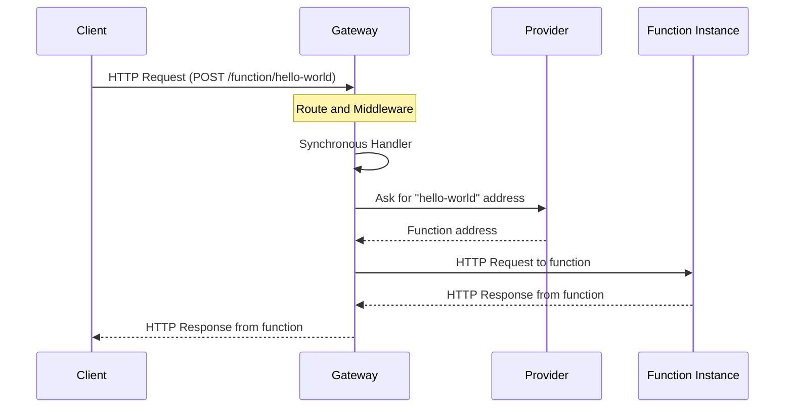
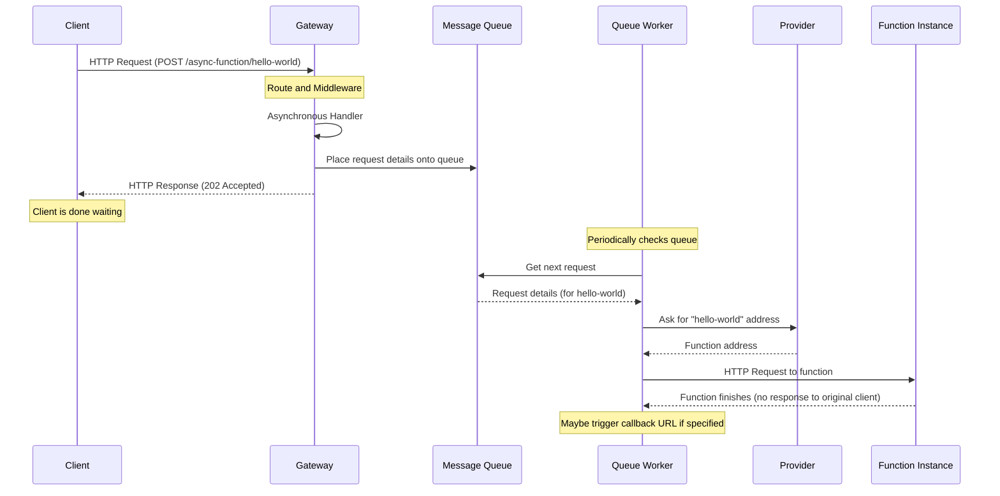

# Chapter 5: Request Handling (Sync/Async)

Welcome back! In the previous chapters, we've explored the OpenFaaS Gateway's central role ([Chapter 1: Gateway Application](01_gateway_application_.md)), how it gets its settings ([Chapter 2: Configuration](02_configuration_.md)), how it defines the ways you can interact with it ([Chapter 3: API Definition](03_api_definition_.md)), and how common tasks like tracing and security are handled by middleware *before* the core logic runs ([Chapter 4: Request Middleware](04_request_middleware_.md)).

Now we arrive at the heart of invoking a function: **Request Handling**. Once a request makes it through the routing and middleware layers, how does the Gateway actually *do* the work of getting that request to your function and potentially getting a response back? This chapter focuses on the two primary ways the Gateway handles function invocation requests: **synchronously** and **asynchronously**.

## What Problem Does Request Handling Solve?

After the Gateway receives an HTTP request directed at a specific function (like `hello-world`) and passes it through any necessary middleware, the core task remains: executing that function with the provided input.

But not all function calls are the same. Sometimes, you need the result immediately. You send a request and you want to block and wait for the function to run and give you an answer right away. Other times, you might be triggering a long-running task (like processing a video or sending many emails) and you *don't* want to wait for it to finish. You just want the Gateway to confirm it has received the request and will process it *eventually*.

This leads to two different patterns for invoking functions:

1.  **Synchronous Invocation:** Send request, wait for function to run, receive function response.
2.  **Asynchronous Invocation:** Send request, Gateway acknowledges receipt immediately, function runs later, no immediate response from the function itself back to the original client.

The **Request Handling** abstraction covers the logic within the Gateway that implements these two distinct invocation patterns.

**Central Use Case:** We want to invoke our `hello-world` function.
*   If we need the "Hello!" message *right now* as part of a web request, we need **Synchronous** handling.
*   If we just want to *trigger* `hello-world` to do something in the background (perhaps it logs "Hello!" somewhere) and we don't need to wait, we can use **Asynchronous** handling.

## What is Synchronous Handling?

**Synchronous handling** is the default and most common way to invoke a function via the OpenFaaS Gateway. When you make a standard HTTP request to the `/function/{name}` endpoint, the Gateway handles it synchronously.

Here's what happens:

1.  You send an HTTP request (e.g., `POST /function/hello-world`) to the Gateway.
2.  The Gateway receives the request, routes it, and middleware runs.
3.  The Gateway's **Synchronous Request Handler** component takes over.
4.  This handler finds the `hello-world` function (by asking the [Provider](07_provider_interaction_.md)).
5.  It makes a new HTTP request *from the Gateway* to the actual running instance of your `hello-world` function.
6.  It waits for the `hello-world` function to finish and send its HTTP response back to the Gateway.
7.  Once the Gateway receives the function's response (status code, headers, body), it copies them and sends them back as the response to your original request.

You, as the client, stay connected to the Gateway and wait until the function has fully executed and its response has been relayed back to you. This is ideal for quick tasks where you need an immediate result.

**Analogy:** Imagine you call a customer service line (the Gateway). You ask them a question (invoke a function). The agent (the Synchronous Handler) puts you on hold while they call an expert (your function) to get the answer. They wait for the expert to give them the answer, hang up with the expert, and then come back to your line to give you the answer. You waited the whole time.



*This diagram shows the core flow: client requests sync invocation, Gateway finds/talks to the function (potentially via Provider for address lookup), waits for the function's response, and sends it back.*

## What is Asynchronous Handling?

**Asynchronous handling** is used when you don't need an immediate response from the function's execution. This is particularly useful for tasks that might take a long time, or tasks you want to queue up and process later without blocking the client.

When you invoke a function asynchronously (typically via the `/async-function/{name}` endpoint or using a specific header on the sync endpoint), the Gateway handles it differently:

1.  You send an HTTP request (e.g., `POST /async-function/hello-world`) to the Gateway.
2.  The Gateway receives the request, routes it, and middleware runs.
3.  The Gateway's **Asynchronous Request Handler** component takes over.
4.  This handler does **not** call the function directly. Instead, it packages up all the details of your request (function name, body, headers, method, etc.).
5.  It places this packaged request onto a **message queue** (like NATS, which is often used by OpenFaaS).
6.  **Immediately**, the Gateway sends back a `202 Accepted` HTTP response to you, the client. This tells you "I got your request and will process it."
7.  Later, a separate component (often called a "queue worker" or built into the Provider) monitors the message queue.
8.  When the worker picks up your request message from the queue, *then* it invokes the actual `hello-world` function instance.
9.  The function runs, but its response (if any) does *not* go back to the original client that sent the asynchronous request. If a response is needed, the function might use a callback URL specified in the original request headers.

You, as the client, are free to do other things as soon as you receive the `202 Accepted`. You don't wait for the function to finish.

**Analogy:** You visit the post office (the Gateway). You want to send a package to someone (invoke a function). You hand the package to the clerk (the Asynchronous Handler). The clerk takes the package, gives you a receipt (`202 Accepted`), and you leave. Later, the postal service's delivery system (the message queue and workers) handles the actual delivery of the package to the recipient (the function). You don't wait at the post office for the package to be delivered.



*This diagram shows the asynchronous flow: client requests async invocation, Gateway places the request on a queue, immediately responds `202 Accepted`. A separate worker later retrieves the request from the queue and invokes the function.*

## Synchronous vs. Asynchronous: Key Differences

Here's a quick comparison:

| Feature           | Synchronous Handling                    | Asynchronous Handling                      |
| :---------------- | :-------------------------------------- | :----------------------------------------- |
| **Client Wait**   | **Yes**, waits for function response.   | **No**, gets immediate `202 Accepted`.     |
| **Gateway Action**| Calls function directly, waits.         | Places request on a queue, doesn't wait.   |
| **Response**      | Function's HTTP response passed back.   | `202 Accepted` response from Gateway.      |
| **Mechanism**     | Direct HTTP request from Gateway.       | Message queueing (e.g., NATS).             |
| **Use Cases**     | Quick tasks, APIs needing immediate data. | Long-running tasks, background processing. |

## How Request Handling Solves Our Use Case

For our `hello-world` use case:

*   To get the output "Hello!" immediately, we use the **synchronous** approach. The Gateway routes the `POST /function/hello-world` request to its synchronous handler. This handler calls the `hello-world` function, gets "Hello!" back, and returns it to our client.
*   To simply trigger `hello-world` to run in the background, we use the **asynchronous** approach. The Gateway routes the `POST /async-function/hello-world` request to its asynchronous handler. This handler packages the request details, puts them on the queue, and returns `202 Accepted` to our client. The function runs later via a queue worker.

The OpenFaaS [API Definition](03_api_definition_.md) clearly defines endpoints like `/function/{name}` for synchronous invocation and `/async-function/{name}` for asynchronous invocation, making it explicit to the client how the request will be handled.

## Gateway's Internal Implementation (Simplified)

Let's look at the core Go code that handles these two types of requests within the Gateway. These are the "handler functions" that the router (from [Chapter 1: Gateway Application](01_gateway_application_.md) and [Chapter 3: API Definition](03_api_definition_.md)) directs the requests to, potentially after middleware has run ([Chapter 4: Request Middleware](04_request_middleware_.md)).

The `types.HandlerSet` struct (introduced in Chapter 4) holds references to these handler functions:

```go
// --- File: gateway/types/handler_set.go (Simplified) ---
package types

import "net/http"

// HandlerSet can be initialized with handlers for binding to mux
type HandlerSet struct {
	// Proxy invokes a function (Synchronous)
	Proxy http.HandlerFunc // <-- This field holds the sync handler

	// QueuedProxy queue work and return synchronous response (Asynchronous)
	QueuedProxy http.HandlerFunc // <-- This field holds the async handler

	// ... other handlers for deploy, list, delete, etc. ...
}
```

The `Proxy` field holds the handler for synchronous calls, and `QueuedProxy` holds the handler for asynchronous calls. Let's see how the functions that create these handlers work.

### Synchronous Handling Code (`MakeForwardingProxyHandler`)

The synchronous handler is often called the "forwarding proxy" because it forwards the client's request directly to the function instance. It's created by the `MakeForwardingProxyHandler` function.

```go
// --- File: gateway/handlers/forwarding_proxy.go (Simplified) ---
package handlers

import (
	"net/http"
	"io"
	"time"
	"net/http/httputil" // For specialized cases like SSE
	"context" // For timeouts
	"log"
)

// MakeForwardingProxyHandler creates the synchronous handler
func MakeForwardingProxyHandler(
	// ... dependencies like a http.Client, URL resolvers, etc. ...
	proxyClient *http.Client, // Client to make outgoing calls
	timeout time.Duration,    // Timeout for the function call
	// ... other params like notifiers, auth injector ...
    reverseProxy *httputil.ReverseProxy, // Used for special cases like Server-Sent Events
) http.HandlerFunc {

	// This returns the actual handler function that will run for each request
	return func(w http.ResponseWriter, r *http.Request) {

		// ... logging, metrics start time ...

		// *** Core logic: Call the function that forwards the request ***
		statusCode, err := forwardRequest(w, r, proxyClient, timeout, reverseProxy)
		if err != nil {
            // Handle the error, write a bad gateway status
			log.Printf("Error forwarding request: %v\n", err)
            http.Error(w, "Error invoking function", http.StatusBadGateway)
            statusCode = http.StatusBadGateway // Ensure correct status is returned
		}

		// ... logging, metrics end time ...

        // Note: w.WriteHeader and io.Copy happen *inside* forwardRequest for success
	}
}

// Simplified forwardRequest function (Actual code is more complex)
func forwardRequest(w http.ResponseWriter, r *http.Request, proxyClient *http.Client, timeout time.Duration, reverseProxy *httputil.ReverseProxy) (int, error) {

	// ... logic to determine the function's actual URL (using BaseURLResolver/URLPathTransformer) ...
	functionURL := "http://actual-function-address/..." // Conceptual simplified URL

	// Build the outgoing request to the function
	upstreamReq, _ := http.NewRequest(r.Method, functionURL, r.Body)
    copyHeaders(upstreamReq.Header, &r.Header) // Copy original headers

    // Apply context with timeout
	ctx, cancel := context.WithTimeout(r.Context(), timeout)
	defer cancel() // Ensure cancel is called to free resources

    // --- Send the request and wait for response ---
	res, err := proxyClient.Do(upstreamReq.WithContext(ctx))
	if err != nil {
		return http.StatusBadGateway, err // Return error if call failed (e.g., timeout, network)
	}
	defer res.Body.Close() // Close function response body

    // --- Copy function response back to the client response ---
    copyHeaders(w.Header(), &res.Header) // Copy function response headers
	w.WriteHeader(res.StatusCode)        // Set client response status code

	if res.Body != nil {
		io.Copy(w, res.Body) // Copy function response body to client response
	}

	return res.StatusCode, nil // Return the status code from the function
}

// Simplified helper (actual function is more robust)
func copyHeaders(destination http.Header, source *http.Header) {
	for k, v := range *source {
		destination[k] = v // Simplified copy
	}
}
```

**Explanation:**

1.  `MakeForwardingProxyHandler` takes dependencies like an `http.Client` and the configured `timeout`.
2.  It returns the actual `http.HandlerFunc`. This function receives the `http.ResponseWriter` (`w`) and `http.Request` (`r`) for the incoming client request.
3.  Inside this handler, the key call is to `forwardRequest`.
4.  `forwardRequest` constructs a *new* HTTP request (`http.NewRequest`) targeted at the function's *actual* internal address. It copies the method, body, and headers from the original client request (`r`).
5.  Crucially, it sets up a `context.WithTimeout` using the configured timeout. This ensures the Gateway doesn't wait forever for a slow function.
6.  `proxyClient.Do(upstreamReq.WithContext(ctx))` sends the request to the function and **blocks until it receives a response or the context times out**.
7.  If successful, it then copies the status code, headers, and body from the function's response (`res`) onto the client's response writer (`w`).
8.  The client receives this crafted response, completing the synchronous call.

### Asynchronous Handling Code (`MakeQueuedProxy`)

The asynchronous handler packages the request and puts it onto a queue. It's created by the `MakeQueuedProxy` function.

```go
// --- File: gateway/handlers/queue_proxy.go (Simplified) ---
package handlers

import (
	"net/http"
	"io"
	"log"

	ftypes "github.com/openfaas/faas-provider/types" // Defines QueueRequest
	"github.com/gorilla/mux" // To get variables from the path
)

// MakeQueuedProxy creates the asynchronous handler
func MakeQueuedProxy(
	// ... dependencies ...
	queuer ftypes.RequestQueuer, // The object that puts requests on the queue
	// ... other params like path transformer, function query ...
) http.HandlerFunc {

	// This returns the actual handler function
	return func(w http.ResponseWriter, r *http.Request) {
		// Read the request body
		var body []byte
		if r.Body != nil {
			defer r.Body.Close()
			var err error
			body, err = io.ReadAll(r.Body)
			if err != nil {
				http.Error(w, "Failed to read request body", http.StatusBadRequest)
				return
			}
		}

        // Get the function name from the URL path
		vars := mux.Vars(r)
		name := vars["name"] // From the /async-function/{name} route

		// Create a QueueRequest object with details from the incoming request
		req := &ftypes.QueueRequest{
			Function:    name,
			Body:        body,
			Method:      r.Method,
			QueryString: r.URL.RawQuery,
			Header:      r.Header,
			Host:        r.Host,
			// CallbackURL: ... // Could get this from a header
		}

		// *** Core logic: Put the request onto the queue ***
		if err := queuer.Queue(req); err != nil {
			log.Printf("Error queuing request: %v", err)
			http.Error(w, "Error queuing request", http.StatusInternalServerError)
			return
		}

		// *** Immediately send 202 Accepted response ***
		w.WriteHeader(http.StatusAccepted)
	}
}
```

**Explanation:**

1.  `MakeQueuedProxy` takes a `ftypes.RequestQueuer` dependency, which knows how to interact with the underlying message queue (like NATS).
2.  It returns the actual `http.HandlerFunc`.
3.  Inside the handler, it reads the incoming request's body and extracts details like the function `name` from the URL using `mux.Vars(r)`.
4.  It creates a `ftypes.QueueRequest` struct, populating it with all the relevant information from the original client request (`r`). This package of info is what will be sent to the queue.
5.  The key call is `queuer.Queue(req)`, which sends the `QueueRequest` object to the message queue. This call is typically very fast.
6.  **Crucially**, immediately after (or while) queuing, it calls `w.WriteHeader(http.StatusAccepted)`. This sends the `202 Accepted` response back to the client without waiting for anything else to happen.

### Wiring Handlers to Routes

As seen conceptually in previous chapters, the `main.go` or router setup code connects these handlers to the specific API paths:

```go
// main.go (Conceptual Router Setup)

// ... initialization including creating the sync and async handlers ...

// Assume syncHandler is created by MakeForwardingProxyHandler (potentially wrapped in middleware)
var syncHandler http.HandlerFunc

// Assume asyncHandler is created by MakeQueuedProxy (potentially wrapped in middleware)
var asyncHandler http.HandlerFunc

// Create the router
r := mux.NewRouter()

// Register the synchronous handler for /function paths
r.HandleFunc("/function/{name:["+NameExpression+"]+}", syncHandler)
r.HandleFunc("/function/{name:["+NameExpression+"]+}/", syncHandler)
r.HandleFunc("/function/{name:["+NameExpression+"]+}/{params:.*}", syncHandler)

// Register the asynchronous handler for /async-function paths
r.HandleFunc("/async-function/{name:["+NameExpression+"]+}", asyncHandler)
r.HandleFunc("/async-function/{name:["+NameExpression+"]+}/", asyncHandler)
r.HandleFunc("/async-function/{name:["+NameExpression+"]+}/{params:.*}", asyncHandler)

// ... register other system routes ...

// Start the server with the configured router
// ...
```

This setup ensures that requests arriving at `/function/...` are processed by the synchronous logic (wait for response), while requests to `/async-function/...` are processed by the asynchronous logic (queue and accept).

## Conclusion

Request Handling is where the OpenFaaS Gateway performs the core task of invoking your functions. It supports two primary modes: synchronous, where the Gateway acts as a blocking proxy forwarding the request and waiting for the function's response, and asynchronous, where the Gateway immediately queues the request and sends a `202 Accepted` response to the client. The Gateway uses distinct handler functions (`MakeForwardingProxyHandler` and `MakeQueuedProxy`) implementing these patterns, which are then mapped to the appropriate API paths by the router. Understanding these two handling modes is crucial for choosing the right way to invoke your functions based on your application's needs.

Now that we've covered how the Gateway handles individual requests, let's look at how it manages the number of function instances running to handle potentially varying loads.

[Chapter 6: Function Scaling](06_function_scaling_.md)

---

<sub><sup>Generated by [AI Codebase Knowledge Builder](https://github.com/The-Pocket/Tutorial-Codebase-Knowledge).</sup></sub> <sub><sup>**References**: [[1]](https://github.com/openfaas/faas/blob/7803ea1861f2a22adcbcfa8c79ed539bc6506d5b/gateway/handlers/forwarding_proxy.go), [[2]](https://github.com/openfaas/faas/blob/7803ea1861f2a22adcbcfa8c79ed539bc6506d5b/gateway/handlers/queue_proxy.go), [[3]](https://github.com/openfaas/faas/blob/7803ea1861f2a22adcbcfa8c79ed539bc6506d5b/gateway/types/handler_set.go)</sup></sub>
