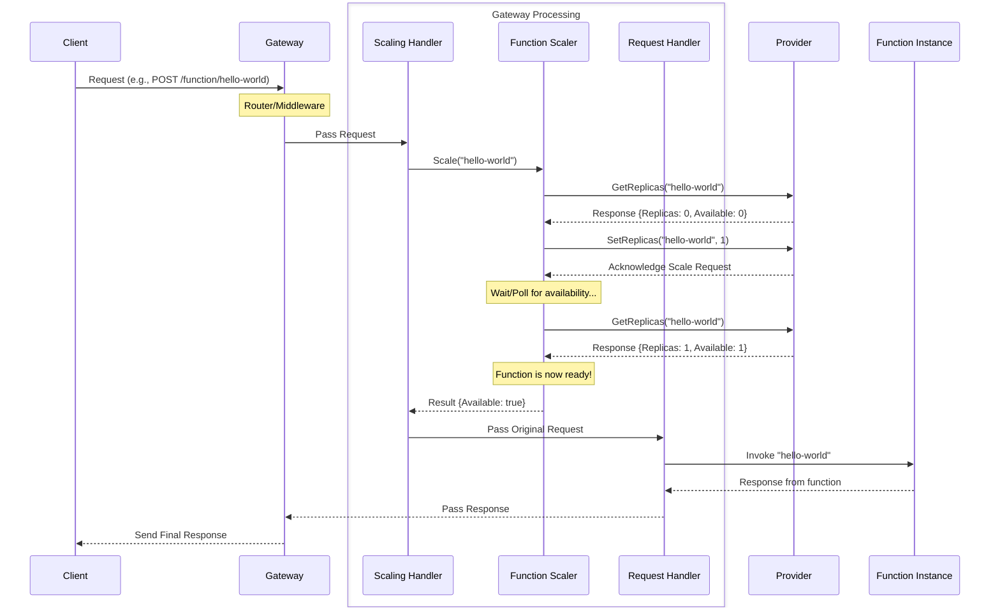

# Chapter 6: Function Scaling

Welcome back! In [Chapter 5: Request Handling (Sync/Async)](05_request_handling__sync_async__.md), we learned how the OpenFaaS Gateway handles individual requests, either by forwarding them directly to a function (synchronous) or by placing them on a queue (asynchronous). But what happens when your function gets *many* requests all at once? A single function instance can only handle so much traffic.

This is where **Function Scaling** comes in.

## What Problem Does Function Scaling Solve?

Imagine your `hello-world` function is super popular and suddenly gets hundreds or thousands of requests hitting the Gateway simultaneously. If you only have one copy (or "replica") of that function running, it will quickly become overwhelmed. Requests will pile up, take a long time to process, or even time out.

The problem is handling variable and potentially high demand. You don't want to waste resources by always running many copies of every function "just in case," but you also need to be able to handle traffic spikes gracefully.

**Central Use Case:** Our `hello-world` function is currently not running (it has 0 replicas to save resources). The first user sends a request to the Gateway to invoke `hello-world`. OpenFaaS should detect that no instances are running, start at least one, and then send the user's request to the newly started instance. If more requests arrive shortly after, and the first instance is busy, OpenFaaS might need to start even *more* copies. This automatic adjustment of function instances based on demand is Function Scaling.

## What is Function Scaling?

**Function Scaling** is the process of dynamically adjusting the number of running instances (replicas) of your functions. This involves:

*   **Scaling Up:** Starting more replicas when demand increases.
*   **Scaling Down:** Stopping replicas when demand decreases (often after a period of inactivity).
*   **Scaling From Zero:** A key feature where a function with 0 replicas is started *on demand* by the first incoming request.

The OpenFaaS Gateway plays a crucial role in the **scale-from-zero** scenario. When a request arrives for a function that isn't running, the Gateway must:

1.  Detect that the function has zero replicas.
2.  Instruct the underlying platform (like Kubernetes or Docker Swarm, via the [Provider](07_provider_interaction_.md)) to start at least one replica.
3.  Wait for the new replica(s) to become ready to receive traffic.
4.  Forward the original request to a ready replica.

Subsequent requests that arrive while the function is scaling up might also be held by the Gateway until replicas are ready, or they might go directly to already available replicas. Once scaled up, the underlying platform's auto-scaler typically handles adding or removing replicas based on CPU load or other metrics (this is often separate from the Gateway's initial scale-from-zero trigger).

## How Scaling Solves Our Use Case

Let's trace the path of the *first* request for `hello-world` when it has 0 replicas:

1.  You send a `POST /function/hello-world` request to the Gateway.
2.  The request goes through routing and middleware ([Chapter 3: API Definition](03_api_definition_.md), [Chapter 4: Request Middleware](04_request_middleware_.md)).
3.  Before hitting the standard synchronous request handler ([Chapter 5: Request Handling (Sync/Async)](05_request_handling__sync_async__.md)), the request is intercepted by a **scaling component**.
4.  The scaling component checks the current status of `hello-world` replicas (by asking the [Provider](07_provider_interaction_.md)).
5.  It finds that `hello-world` has 0 replicas.
6.  It instructs the [Provider](07_provider_interaction_.md) to scale `hello-world` up to its minimum replica count (usually 1, but can be configured).
7.  The Gateway's scaling component then enters a waiting loop, periodically asking the [Provider](07_provider_interaction_.md) if the new replica(s) are "available" (ready to accept requests).
8.  Once at least one replica is reported as available, the scaling component allows the original request to proceed to the standard synchronous request handler ([Chapter 5: Request Handling (Sync/Async)](05_request_handling__sync_async__.md)).
9.  The request handler forwards the request to the now-ready `hello-world` instance.
10. The function executes, and the response is sent back through the Gateway to you.

This process means the *first* request hitting a cold function will experience higher latency because it has to wait for the function to start. However, it ensures the function is running and ready for that request and subsequent ones.

Here's a simplified flow for a scale-from-zero scenario triggered by the first request:



*This diagram illustrates the critical steps during scale-from-zero: the request triggers the scaling handler, which uses the function scaler to query/set replicas via the Provider and waits until an instance is available before passing the request to the regular request handler.*

## Gateway's Internal Implementation (Simplified)

The scale-from-zero logic in the Gateway is implemented as a middleware-like handler. It intercepts the request *before* the main synchronous or asynchronous handler.

Let's look at snippets from the Go code.

First, the `MakeScalingHandler` function creates the handler that performs the scaling check and wait:

```go
// --- File: gateway/handlers/scaling.go (Simplified) ---

// MakeScalingHandler creates handler which can scale a function from
// zero to N replica(s). After scaling, the next http.HandlerFunc will be called.
// If scaling times out, an error status is returned instead.
func MakeScalingHandler(next http.HandlerFunc, scaler scaling.FunctionScaler, config scaling.ScalingConfig, defaultNamespace string) http.HandlerFunc {

	// This returns the actual middleware function executed for each request
	return func(w http.ResponseWriter, r *http.Request) {

		// 1. Get function name from the request path
		functionName, namespace := middleware.GetNamespace(defaultNamespace, middleware.GetServiceName(r.URL.String()))

		// 2. Use the injected FunctionScaler to perform the scaling check/wait
		res := scaler.Scale(functionName, namespace) // <-- This is the core scaling logic call

		// 3. Check the result of the scaling operation
		if !res.Found { // Function not found at all
			w.WriteHeader(http.StatusNotFound)
			w.Write([]byte(fmt.Sprintf("error finding function %s.%s: %s", functionName, namespace, res.Error.Error())))
			return
		}

		if res.Error != nil { // An error occurred during scaling or lookup
			w.WriteHeader(http.StatusInternalServerError)
			w.Write([]byte(fmt.Sprintf("error finding function %s.%s: %s", functionName, namespace, res.Error.Error())))
			return
		}

		if res.Available { // Function is ready (was already running or just scaled/woke up)
			// 4. If ready, call the next handler in the chain (the sync/async handler)
			next.ServeHTTP(w, r)
			return
		}

		// 5. If not available after the scale/wait process (timed out)
		log.Printf("[Scale] function=%s.%s 0=>N timed-out after %.4fs\n",
			functionName, namespace, res.Duration.Seconds())
		// Note: In the actual code, a timeout often results in a 504 Gateway Timeout status.
        // This simplified snippet implies success flows or basic errors.
	}
}
```

**Explanation:**

*   `MakeScalingHandler` is a factory that takes the `next` handler (the one that does the actual request forwarding/queuing), a `FunctionScaler` object (which contains the core scaling logic), and configuration.
*   It returns an `http.HandlerFunc` that runs for each request potentially subject to scale-from-zero.
*   This handler gets the function name.
*   It calls `scaler.Scale(functionName, namespace)`. This is the blocking call that checks status, triggers scaling if needed, and **waits** until the function is ready or a timeout occurs.
*   Based on the result (`res.Available`), it either calls `next.ServeHTTP(w, r)` to let the request continue to the next handler (sync/async), or it writes an error response.

Now, let's look at the `FunctionScaler`'s `Scale` method, which contains the detailed logic:

```go
// --- File: gateway/scaling/function_scaler.go (Simplified) ---

type FunctionScaler struct {
	Cache        FunctionCacher // Cache for replica counts
	Config       ScalingConfig  // Scaling settings
	SingleFlight *singleflight.Group // To prevent duplicate concurrent scale attempts
}

// Scale scales a function from zero replicas to 1 or the value set in min replicas
// and waits for it to become available.
func (f *FunctionScaler) Scale(functionName, namespace string) FunctionScaleResult {
	start := time.Now()

	// 1. Check cache first (optimization)
	if cachedResponse, hit := f.Cache.Get(functionName, namespace); hit &&
		cachedResponse.AvailableReplicas > 0 {
		// Cache says it's available, return immediately
		return FunctionScaleResult{Available: true, Found: true, Duration: time.Since(start)}
	}

	// 2. If not available in cache, query the live status via the ServiceQuery (talks to Provider)
    // Use SingleFlight to ensure only one concurrent query/scale happens per function
	getKey := fmt.Sprintf("GetReplicas-%s.%s", functionName, namespace)
	res, err, _ := f.SingleFlight.Do(getKey, func() (interface{}, error) {
		// This function runs only once concurrently for this key
		return f.Config.ServiceQuery.GetReplicas(functionName, namespace) // Ask the Provider
	})

	// Handle query errors
	if err != nil { /* ... error handling ... */ return FunctionScaleResult{Error: err, Found: false, Duration: time.Since(start)} }
    queryResponse := res.(ServiceQueryResponse) // Cast result

	// 3. If live data shows replicas > 0, it's available now (maybe scaled recently by others)
	if queryResponse.AvailableReplicas > 0 {
		f.Cache.Set(functionName, namespace, queryResponse) // Update cache
		return FunctionScaleResult{Available: true, Found: true, Duration: time.Since(start)}
	}

	// 4. Store the current (potentially 0) replicas in cache
	f.Cache.Set(functionName, namespace, queryResponse)

	// 5. If desired replicas are 0, trigger scale up via the Provider
	if queryResponse.Replicas == 0 {
		minReplicas := uint64(1) // Default to 1 replica
		if queryResponse.MinReplicas > 0 { minReplicas = queryResponse.MinReplicas } // Use configured min if set

        // Retry loop to attempt setting replicas multiple times if needed
		scaleResult := types.Retry(func(attempt int) error {
			// Inside retry: Re-query to be sure it hasn't scaled already
			res, err, _ := f.SingleFlight.Do(getKey, func() (interface{}, error) {
				return f.Config.ServiceQuery.GetReplicas(functionName, namespace) // Ask the Provider again
			})
            if err != nil { return err }
            queryResponse = res.(ServiceQueryResponse)
            f.Cache.Set(functionName, namespace, queryResponse)

			// If desired replicas are now > 0, scaling is in progress, exit retry
			if queryResponse.Replicas > 0 { return nil }

			// If still 0 desired replicas, tell Provider to SetReplicas
			setKey := fmt.Sprintf("SetReplicas-%s.%s", functionName, namespace)
			_, err, _ := f.SingleFlight.Do(setKey, func() (interface{}, error) {
                log.Printf("[Scale] %s 0 => %d requested", functionName, minReplicas)
				return nil, f.Config.ServiceQuery.SetReplicas(functionName, namespace, minReplicas) // Tell the Provider to scale
			})
            return err // Return error if SetReplicas failed
		}, "Scale", int(f.Config.SetScaleRetries), f.Config.FunctionPollInterval) // Retry config

		if scaleResult != nil { /* ... error handling ... */ return FunctionScaleResult{Error: scaleResult, Found: true, Duration: time.Since(start)} }
	}

	// 6. Holding pattern: Poll the Provider repeatedly until replicas are available or timeout
	for i := 0; i < int(f.Config.MaxPollCount); i++ {

        // Query live status again, using SingleFlight
		res, err, _ := f.SingleFlight.Do(getKey, func() (interface{}, error) {
			return f.Config.ServiceQuery.GetReplicas(functionName, namespace) // Ask the Provider again
		})
        queryResponse := res.(ServiceQueryResponse)

		if err == nil { f.Cache.Set(functionName, namespace, queryResponse) } // Update cache if query succeeded

		if err != nil { /* ... error handling ... */ return FunctionScaleResult{Error: err, Found: true, Duration: time.Since(start)} }

		// 7. If replicas are available, return success!
		if queryResponse.AvailableReplicas > 0 {
			log.Printf("[Ready] function=%s waited for - %.4fs", functionName, time.Since(start).Seconds())
			return FunctionScaleResult{Available: true, Found: true, Duration: time.Since(start)}
		}

		// 8. If not available, wait and poll again
		time.Sleep(f.Config.FunctionPollInterval)
	}

	// 9. If the loop finishes, it timed out waiting for readiness
    // Note: The actual code might return false here or rely on the outer handler logic for timeout status.
	return FunctionScaleResult{Available: true, Found: true, Duration: time.Since(start)} // Simplified: Assume it eventually becomes available or timeout handled externally
}
```

**Explanation:**

*   The `Scale` method first checks a `Cache` (`FunctionCacher`) to quickly see if the function was recently known to have available replicas. This avoids hitting the [Provider](07_provider_interaction_.md) on *every* request.
*   It then uses `SingleFlight` to ensure that if multiple requests for the *same* function arrive at the same time, only one of them triggers the actual check/scale process via the [Provider](07_provider_interaction_.md). The others wait for the first one's result.
*   It calls `f.Config.ServiceQuery.GetReplicas` to get the current status from the [Provider](07_provider_interaction_.md) (replica count, available replicas).
*   If the `GetReplicas` call shows 0 *desired* replicas (`queryResponse.Replicas == 0`), it enters a `Retry` loop. This loop ensures that if setting replicas fails the first time, it tries again. Inside the retry, it calls `f.Config.ServiceQuery.SetReplicas` to tell the [Provider](07_provider_interaction_.md) to scale up.
*   After triggering a scale-up (or if the function already had desired replicas > 0 but none available yet), it enters a polling `for` loop (`MaxPollCount`).
*   Inside this loop, it repeatedly calls `f.Config.ServiceQuery.GetReplicas` to check `AvailableReplicas`.
*   It waits (`time.Sleep`) between polls (`FunctionPollInterval`).
*   Once `AvailableReplicas > 0`, the function is ready, and `Scale` returns `Available: true`.
*   If the loop finishes without any replicas becoming available within the configured time, the scale-from-zero process times out for this request.

The `ServiceQuery` interface defines the contract for interacting with the [Provider](07_provider_interaction_.md) to get and set replica counts:

```go
// --- File: gateway/scaling/service_query.go ---

// ServiceQuery provides interface for replica querying/setting
type ServiceQuery interface {
	GetReplicas(service, namespace string) (response ServiceQueryResponse, err error)
	SetReplicas(service, namespace string, count uint64) error
}

// ServiceQueryResponse response from querying a function status
type ServiceQueryResponse struct {
	Replicas          uint64 // Desired replicas
	AvailableReplicas uint64 // Replicas ready to handle traffic
    // ... other scaling details like MaxReplicas, MinReplicas, etc. ...
}
```

This shows that the `FunctionScaler` doesn't talk directly to Kubernetes or Docker Swarm; it talks to an object that implements the `ServiceQuery` interface, and that object is responsible for the actual communication with the underlying platform via the [Provider](07_provider_interaction_.md).

## Conclusion

Function Scaling, particularly the scale-from-zero feature, is essential for making OpenFaaS efficient and responsive to variable load. The Gateway's role is to detect when a function with zero replicas receives traffic, trigger the underlying [Provider](07_provider_interaction_.md) to scale it up, and wait for instances to become ready before forwarding the request. This introduces latency for the initial request but ensures functions are only consuming resources when they are needed. The `FunctionScaler` uses caching, single-flight concurrency control, polling, and retries to robustly handle this process by interacting with the [Provider](07_provider_interaction_.md)'s `ServiceQuery` interface.

Understanding that the Gateway relies on the [Provider](07_provider_interaction_.md) for information about function status and to perform the actual scaling actions is key. In the next chapter, we'll explore this critical interaction further.

[Chapter 7: Provider Interaction](07_provider_interaction_.md)

---

<sub><sup>Generated by [AI Codebase Knowledge Builder](https://github.com/The-Pocket/Tutorial-Codebase-Knowledge).</sup></sub> <sub><sup>**References**: [[1]](https://github.com/openfaas/faas/blob/7803ea1861f2a22adcbcfa8c79ed539bc6506d5b/gateway/handlers/scaling.go), [[2]](https://github.com/openfaas/faas/blob/7803ea1861f2a22adcbcfa8c79ed539bc6506d5b/gateway/scaling/function_cache.go), [[3]](https://github.com/openfaas/faas/blob/7803ea1861f2a22adcbcfa8c79ed539bc6506d5b/gateway/scaling/function_meta.go), [[4]](https://github.com/openfaas/faas/blob/7803ea1861f2a22adcbcfa8c79ed539bc6506d5b/gateway/scaling/function_scaler.go), [[5]](https://github.com/openfaas/faas/blob/7803ea1861f2a22adcbcfa8c79ed539bc6506d5b/gateway/scaling/scaling_config.go), [[6]](https://github.com/openfaas/faas/blob/7803ea1861f2a22adcbcfa8c79ed539bc6506d5b/gateway/scaling/service_query.go), [[7]](https://github.com/openfaas/faas/blob/7803ea1861f2a22adcbcfa8c79ed539bc6506d5b/gateway/scaling/single.go)</sup></sub>
