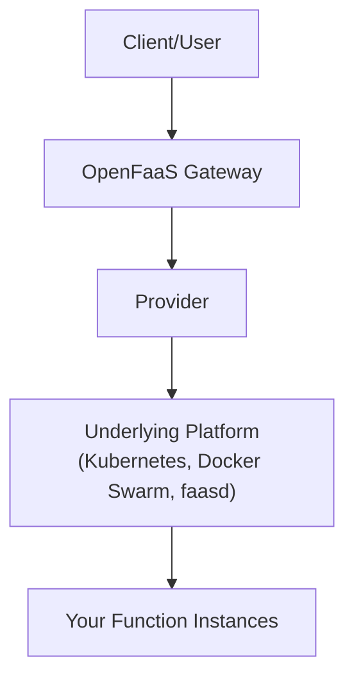
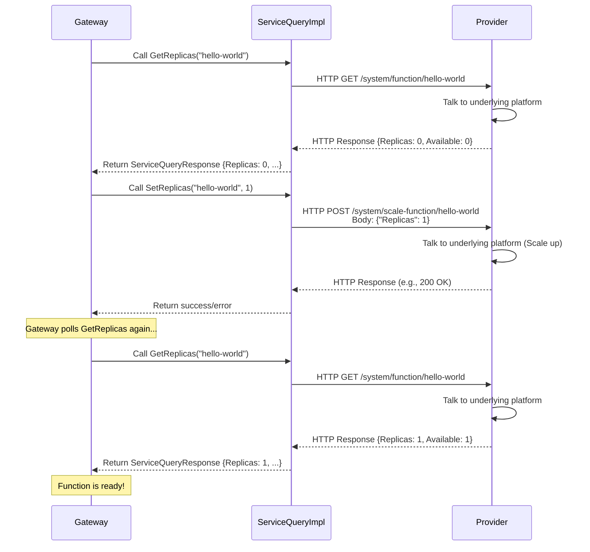

# Chapter 7: Provider Interaction

Welcome back! In [Chapter 6: Function Scaling](./Chapter_6.md), we saw how the OpenFaaS Gateway handles the crucial task of scaling your functions, especially the "scale-from-zero" feature, by checking how many function instances (replicas) are running and telling the system to start more if needed. But who is this "system" the Gateway talks to?

The Gateway itself doesn't know the intricate details of running containers on Kubernetes or Docker Swarm. It needs another component that *does* know how to talk to these underlying platforms. This is where the **Provider Interaction** layer comes in.

## What Problem Does Provider Interaction Solve?

Imagine the OpenFaaS Gateway as a high-level manager. It knows *what* needs to happen (like "invoke function `hello-world`" or "make sure `hello-world` has at least one instance running"). But it doesn't know the low-level details of *how* to achieve that on a specific platform.

For example:
*   How does the Gateway find out how many copies of `hello-world` are currently running?
*   How does it tell Kubernetes or Docker Swarm to start a new instance of `hello-world`?
*   Where does it get the actual network address to send the request to a running `hello-world` instance?

The way you list deployments, check replica counts, or scale services is completely different between Kubernetes, Docker Swarm, and other potential platforms like `faasd`. The Gateway needs a consistent way to ask for information and request actions, regardless of the underlying platform.

This is the problem the **Provider Interaction** layer solves. It acts as a translator and intermediary. The Gateway talks to the **Provider** using a standard "language" (a defined interface), and the Provider translates those requests into the specific commands needed for the underlying platform.

**Central Use Case:** When the Gateway receives the *first* request for our `hello-world` function (which currently has 0 replicas), it needs to:
1. Ask the system: "What is the current status of `hello-world`?" (specifically, how many replicas are running?).
2. Tell the system: "Please start at least one replica of `hello-world`."
3. Wait for the system to confirm: "Okay, `hello-world` now has a running instance ready."

All these interactions happen between the Gateway and the **Provider**.

## What is Provider Interaction?

**Provider Interaction** refers to the communication and interface between the OpenFaaS Gateway and the **Provider** component. The **Provider** is a separate process or component responsible for interfacing directly with the underlying container orchestration platform (like Kubernetes, Docker Swarm, AWS ECS, faasd running on a VM, etc.).

Think of the relationship like this:



The Gateway needs to interact with the Provider for several key tasks:

1.  **Querying Function Status:** Asking for details about deployed functions, such as:
    *   How many replicas are desired?
    *   How many replicas are currently running and available?
    *   What configuration (labels, annotations, environment variables) does the function have?
    *   (Less direct via Provider interaction, but related) What is the network address of a running instance?
2.  **Requesting Scaling Actions:** Telling the Provider to change the number of desired replicas for a function.
3.  **Function Management:** (Handled by other parts of the Gateway, but also using Provider interaction) Deploying, updating, or deleting functions.

The Gateway defines standard **interfaces** in its code (like the `ServiceQuery` interface we saw in [Chapter 6: Function Scaling](./Chapter_6.md)) that any Provider implementation must satisfy. This allows OpenFaaS to swap out the Provider component to support different platforms without changing the core Gateway logic.

## How Provider Interaction Solves Our Use Case

Let's revisit the scale-from-zero use case for `hello-world`. The Gateway needs to know if `hello-world` is running and needs to trigger scaling.

1.  The Gateway receives the request for `hello-world`.
2.  The [Scaling Handler](./Chapter_6.md) within the Gateway is triggered.
3.  The Scaling Handler uses the configured `FunctionScaler` object.
4.  The `FunctionScaler` needs to know the current status of `hello-world`. It calls a method defined by the `ServiceQuery` interface, specifically `GetReplicas("hello-world")`.
5.  The *implementation* of `ServiceQuery` that the Gateway is using (e.g., `ExternalServiceQuery` which talks to a separate Provider process) receives this call.
6.  This `ServiceQuery` implementation translates the request "Get replicas for hello-world" into an HTTP request to the actual **Provider** component (which is listening on its own API endpoints). The URL might look like `/system/function/hello-world`.
7.  The **Provider** component receives this HTTP request. It then talks to the underlying platform (like Kubernetes API or Docker Swarm API) to get the status of the `hello-world` deployment/service.
8.  The Provider gets the status back from the platform (e.g., desired: 0, available: 0).
9.  The Provider formats this information into a standard response and sends it back via HTTP to the Gateway's `ServiceQuery` implementation.
10. The `ServiceQuery` implementation receives the HTTP response and returns the structured status information (the `ServiceQueryResponse`) back to the `FunctionScaler` in the Gateway.
11. The `FunctionScaler` sees that `AvailableReplicas` is 0. It determines it needs to scale up.
12. The `FunctionScaler` calls another method defined by the `ServiceQuery` interface: `SetReplicas("hello-world", 1)`.
13. The `ServiceQuery` implementation translates this request "Set replicas for hello-world to 1" into another HTTP request to the actual **Provider** component. The URL might look like `/system/scale-function/hello-world`.
14. The **Provider** component receives this HTTP request and talks to the underlying platform (Kubernetes/Docker Swarm API) to request the scaling action.
15. The platform starts a new instance.
16. The Provider sends an acknowledgment back to the Gateway's `ServiceQuery` implementation.
17. The `FunctionScaler` in the Gateway receives the acknowledgment and starts polling (`GetReplicas` calls) until the Provider reports `AvailableReplicas > 0`.

This multi-step interaction, mediated by the `ServiceQuery` interface and its concrete implementation talking to the Provider, is how the Gateway manages functions on different platforms.

Here's a simplified sequence diagram focusing on the Gateway <-> Provider interaction for scaling:



This diagram shows the Gateway relying on the `ServiceQuery` implementation to make calls to the Provider's API, which in turn interacts with the underlying platform.

## Gateway's Internal Implementation (Simplified)

The provided code snippets show how the `ServiceQuery` interface (from `gateway/scaling/service_query.go`) is implemented by `ExternalServiceQuery` (from `gateway/plugin/external.go`). This `ExternalServiceQuery` implementation communicates with a separate Provider process over HTTP.

### The `ServiceQuery` Interface

As seen in [Chapter 6](./Chapter_6.md), this interface defines the contract:

```go
// --- File: gateway/scaling/service_query.go ---

// ServiceQuery provides interface for replica querying/setting
type ServiceQuery interface {
	GetReplicas(service, namespace string) (response ServiceQueryResponse, err error) // Get function status
	SetReplicas(service, namespace string, count uint64) error                      // Request scaling
}

// ServiceQueryResponse response from querying a function status
type ServiceQueryResponse struct {
	Replicas          uint64 // Desired replicas
	AvailableReplicas uint64 // Replicas ready to handle traffic
    MaxReplicas       uint64 // Max allowed replicas
    MinReplicas       uint64 // Min desired replicas
    ScalingFactor     uint64 // How many to scale up by
    Annotations       *map[string]string // Function annotations
    // ... potentially other fields ...
}
```

The Gateway code that *needs* to know function status or request scaling only depends on this `ServiceQuery` interface, not on the specific *type* of Provider (Kubernetes, faasd, etc.).

### The `ExternalServiceQuery` Implementation

This struct implements the `ServiceQuery` interface by making HTTP calls to an external Provider process.

```go
// --- File: gateway/plugin/external.go (Simplified) ---

// ExternalServiceQuery proxies service queries to external plugin via HTTP
type ExternalServiceQuery struct {
	URL          url.URL      // The URL of the external Provider's API
	ProxyClient  http.Client  // HTTP client to make the calls
	AuthInjector middleware.AuthInjector // Optional: for adding auth headers
	IncludeUsage bool
}

// NewExternalServiceQuery creates an ExternalServiceQuery
func NewExternalServiceQuery(externalURL url.URL, authInjector middleware.AuthInjector) scaling.ServiceQuery {
	// ... setup of a simple http.Client with timeouts ...
    // Returns an instance of ExternalServiceQuery
    return ExternalServiceQuery{
        URL: externalURL,
        ProxyClient: http.Client{ /* configured client */ },
        AuthInjector: authInjector,
    }
}
```

**Explanation:**

*   `ExternalServiceQuery` holds the `URL` of the external Provider and an `http.Client` to communicate with it.
*   `NewExternalServiceQuery` is a factory function to create an instance, taking the Provider's URL as input (which comes from the Gateway's [Configuration](./Chapter_2.mdd), likely the `functions_provider_url`).

### Implementing `GetReplicas`

This method makes an HTTP GET request to the Provider's API to fetch function status.

```go
// --- File: gateway/plugin/external.go (Simplified GetReplicas) ---

// GetReplicas replica count for function
func (s ExternalServiceQuery) GetReplicas(serviceName, serviceNamespace string) (scaling.ServiceQueryResponse, error) {
	// 1. Construct the URL for the Provider's GET function status endpoint
	urlPath := fmt.Sprintf("%ssystem/function/%s?namespace=%s&usage=%v",
		s.URL.String(), // Base URL of the Provider (from config)
		serviceName,
		serviceNamespace,
		s.IncludeUsage)

	// 2. Create an HTTP GET request
	req, err := http.NewRequest(http.MethodGet, urlPath, nil)
	if err != nil { return scaling.ServiceQueryResponse{}, err }

	// Optional: Inject authentication headers
	if s.AuthInjector != nil { s.AuthInjector.Inject(req) }

	// 3. Send the request to the Provider via the HTTP client
	res, err := s.ProxyClient.Do(req)
	if err != nil {
		log.Println(urlPath, err)
		return scaling.ServiceQueryResponse{}, err
	}
	defer res.Body.Close() // Ensure the response body is closed

	// 4. Read the response body
	bytesOut, _ := io.ReadAll(res.Body)

	// 5. Handle non-200 status codes from the Provider
	if res.StatusCode != http.StatusOK {
        // Log error and return error
		log.Printf("Provider returned non-200 status: %d", res.StatusCode)
		return scaling.ServiceQueryResponse{}, fmt.Errorf("Provider error")
	}

	// 6. Unmarshal the JSON response into a FunctionStatus struct
	var function types.FunctionStatus // types.FunctionStatus is defined in the faas-provider library
	if err := json.Unmarshal(bytesOut, &function); err != nil {
		log.Printf("Unable to unmarshal Provider response: %s", err)
		return scaling.ServiceQueryResponse{}, err
	}

	// 7. Map the Provider's response format (FunctionStatus)
	//    to the Gateway's expected format (ServiceQueryResponse)
    //    This includes extracting scale-related labels if present
    response := scaling.ServiceQueryResponse{
        Replicas: function.Replicas,
        AvailableReplicas: function.AvailableReplicas,
        Annotations: function.Annotations,
        // ... extract Min/Max/Factor from function.Labels ...
    }

	// 8. Return the populated ServiceQueryResponse
	return response, nil
}
```

**Explanation:**

*   The method constructs the full URL for the Provider's `/system/function/{name}` endpoint. This endpoint is part of the *Provider's own API*, defined by the `faas-provider` library, which all compliant Providers must implement.
*   It creates an `http.NewRequest` targeting this URL.
*   `s.ProxyClient.Do(req)` sends the request over HTTP and waits for the Provider's response.
*   It checks the HTTP status code from the Provider.
*   If successful (200 OK), it reads and JSON-unmarshals the response body into a `types.FunctionStatus` struct (defined by the `faas-provider` library). This struct contains the function's status details as reported by the Provider.
*   Finally, it translates the data from the `types.FunctionStatus` struct into the Gateway's expected `scaling.ServiceQueryResponse` struct, handling things like extracting scaling labels, and returns it.

### Implementing `SetReplicas`

This method makes an HTTP POST request to the Provider's API to request a scaling action.

```go
// --- File: gateway/plugin/external.go (Simplified SetReplicas) ---

// SetReplicas update the replica count by telling the Provider
func (s ExternalServiceQuery) SetReplicas(serviceName, serviceNamespace string, count uint64) error {
	// 1. Create the request body (JSON) telling the Provider what to scale
	scaleReq := types.ScaleServiceRequest{ // types.ScaleServiceRequest from faas-provider
		ServiceName: serviceName,
		Replicas:    count, // The desired replica count
	}
	requestBody, err := json.Marshal(scaleReq)
	if err != nil { return err }

	// 2. Construct the URL for the Provider's POST scale endpoint
	urlPath := fmt.Sprintf("%ssystem/scale-function/%s?namespace=%s",
		s.URL.String(), // Base URL of the Provider
		serviceName,
		serviceNamespace)

	// 3. Create an HTTP POST request with the JSON body
	req, _ := http.NewRequest(http.MethodPost, urlPath, bytes.NewReader(requestBody))
    req.Header.Set("Content-Type", "application/json") // Standard for JSON body

	// Optional: Inject authentication headers
	if s.AuthInjector != nil { s.AuthInjector.Inject(req) }

	// 4. Send the request to the Provider via the HTTP client
	res, err := s.ProxyClient.Do(req)

	if err != nil {
		log.Println(urlPath, err)
		return err
	}
	defer res.Body.Close()

	// 5. Handle non-successful status codes from the Provider
	if !(res.StatusCode == http.StatusOK || res.StatusCode == http.StatusAccepted) {
		// Log error and return error
		log.Printf("Provider returned non-OK status for scale: %d", res.StatusCode)
		return fmt.Errorf("Provider scale error")
	}

	// 6. If Provider returned 200 OK or 202 Accepted, the request was successful
	log.Printf("Scale request sent to Provider for %s: %d replicas", serviceName, count)

	return nil // Success
}
```

**Explanation:**

*   It creates a `types.ScaleServiceRequest` struct (defined in `faas-provider`) containing the function name and the target `Replicas` count.
*   It marshals this struct into a JSON byte slice (`requestBody`).
*   It constructs the URL for the Provider's `/system/scale-function/{name}` endpoint.
*   It creates an `http.NewRequest` with the `POST` method, the Provider's scale URL, and the JSON request body.
*   It sets the `Content-Type` header to `application/json`.
*   `s.ProxyClient.Do(req)` sends the request.
*   It checks the HTTP status code from the Provider. A 200 OK or 202 Accepted indicates the Provider successfully received the scale request. Other codes indicate an error.
*   It returns `nil` on success or an error if the HTTP call failed or the Provider returned a non-success status.

This implementation clearly shows the Gateway acting as a client making HTTP requests to the Provider's API (`s.URL` from configuration). The Gateway doesn't know *how* the Provider talks to Kubernetes; it just knows the Provider has HTTP endpoints it can call via the defined `ServiceQuery` interface to get status and request scaling.

During Gateway startup, the `functions_provider_url` from configuration is used to create the appropriate `ServiceQuery` implementation (like `ExternalServiceQuery`), and this object is then dependency-injected into components like the `FunctionScaler`.

## Conclusion

Provider Interaction is the essential communication bridge between the OpenFaaS Gateway and the platform-specific **Provider** component. By defining standard interfaces like `ServiceQuery`, the Gateway can query function status (replicas, annotations) and request scaling actions without needing to know the specifics of the underlying orchestration platform (Kubernetes, Docker Swarm, etc.). Implementations like `ExternalServiceQuery` translate these interface calls into HTTP requests to the Provider's own API endpoints (`/system/function` and `/system/scale-function`), allowing OpenFaaS to support multiple platforms using a consistent Gateway codebase.

Now that we understand how the Gateway gets status and triggers scaling by talking to the Provider, let's look at how OpenFaaS collects and reports metrics to understand the performance and health of your functions and the system itself.

[Chapter 8: Metrics & Monitoring](./Chapter_8.md)

---

<sub><sup>Generated by [AI Codebase Knowledge Builder](https://github.com/The-Pocket/Tutorial-Codebase-Knowledge).</sup></sub> <sub><sup>**References**: [[1]](https://github.com/openfaas/faas/blob/7803ea1861f2a22adcbcfa8c79ed539bc6506d5b/gateway/plugin/external.go), [[2]](https://github.com/openfaas/faas/blob/7803ea1861f2a22adcbcfa8c79ed539bc6506d5b/gateway/scaling/service_query.go)</sup></sub>
