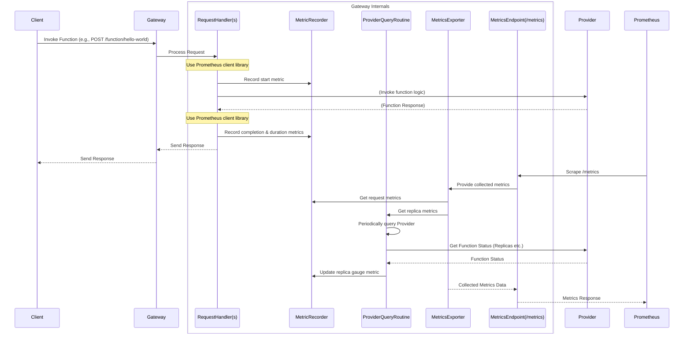

# Chapter 8: Metrics & Monitoring

Welcome back! In [Chapter 7: Provider Interaction](./Chapter_7.md), we saw how the OpenFaaS Gateway communicates with the **Provider** to get function status (like replica counts) and trigger scaling actions. This backend communication is essential for the Gateway to manage your functions.

But how do you, as a user or operator, know what's *really* happening in your OpenFaaS system? How many times was your `hello-world` function called today? Is it running fast or slow? Is the system scaling functions up and down correctly?

This is where **Metrics & Monitoring** come in.

## What Problem Does Metrics & Monitoring Solve?

Running applications, especially distributed systems like OpenFaaS, requires visibility. You need to understand:

*   **Performance:** How quickly are functions responding? Are there slow functions?
*   **Traffic Load:** Which functions are being called the most? When are the peak times?
*   **Resource Usage:** How many instances of each function are running? Is the scaling working as expected?
*   **Health:** Are there errors happening during invocations? Are functions crashing?

Without this information, you're flying blind. You can't diagnose problems, optimize performance, predict capacity needs, or confirm that your functions are behaving as expected.

**Central Use Case:** We've invoked our `hello-world` function. We want to know:
1.  How many times has `hello-world` been invoked in total?
2.  What is the average time it takes for `hello-world` to respond?
3.  How many instances (replicas) of `hello-world` are currently running?

Metrics and monitoring provide the data needed to answer these questions.

## What are Metrics & Monitoring?

In OpenFaaS, **Metrics** are numerical measurements collected about the system's behavior. Think of them as data points like:
*   Total number of times a function was called.
*   The time taken for each function call.
*   The current number of replicas for a function.

**Monitoring** is the process of collecting, storing, visualizing, and alerting on these metrics. OpenFaaS is designed to expose its metrics in a standardized format that popular monitoring systems, like **Prometheus**, can easily collect.

The OpenFaaS Gateway, being the central entry point, is a key source of these metrics. It can observe every incoming function invocation request and track its progress. It can also periodically check in on the status of functions by talking to the [Provider](./Chapter_7.md).

All the metrics collected by the Gateway are exposed via a dedicated HTTP endpoint, typically `/metrics`. This endpoint is designed to be "scraped" (read) by monitoring systems like Prometheus.

## Key Metrics Exposed by the Gateway

The Gateway exposes several important metrics, including:

*   **Invocation Counts:**
    *   `gateway_function_invocation_started_total`: Total number of times a function invocation request *started* processing in the Gateway.
    *   `gateway_function_invocation_total`: Total number of times a function invocation request *completed* processing in the Gateway, broken down by HTTP status code.
*   **Invocation Duration:**
    *   `gateway_functions_seconds`: A histogram tracking the duration (in seconds) of function invocations as measured by the Gateway, also broken down by status code. This gives average, min, max, and distribution information.
*   **Replica Counts:**
    *   `gateway_service_count`: The current number of desired and available replicas for each function, as reported by the [Provider](./Chapter_7.md). This is a "gauge" metric, representing a point-in-time value.

These metrics are labeled with the `function_name` and sometimes `code` (for status code), allowing you to filter and aggregate data per function.

## How Metrics & Monitoring Solve Our Use Case

To answer our questions about the `hello-world` function:

1.  **How many times invoked?** You would query your monitoring system (like Prometheus) for the value of the `gateway_function_invocation_total` metric, filtered by `function_name="hello-world"`.
2.  **Average response time?** You would query the `gateway_functions_seconds` metric, filtered by `function_name="hello-world"`, to get statistics like the average or 95th percentile duration.
3.  **How many replicas running?** You would query the `gateway_service_count` metric, filtered by `function_name="hello-world"`, specifically looking at the "available" count.

This allows you to see charts and dashboards showing this data over time, giving you insight into `hello-world`'s usage and performance.

Furthermore, these metrics can be used for:

*   **Alerting:** Set up alerts in Prometheus (or a connected system) if `gateway_functions_seconds` for `hello-world` suddenly increases (slow function) or if `gateway_service_count` drops unexpectedly.
*   **Auto-scaling:** While the scale-from-zero logic is built into the Gateway as we saw in [Chapter 6: Function Scaling](./Chapter_6.md), more advanced auto-scaling (like scaling based on CPU usage or queue length) is often handled by the underlying platform (like Kubernetes HPA) or external components that consume these metrics. The `gateway_service_count` is directly used within the Gateway's own `FunctionScaler` when determining the current state. Alerts based on invocation rates (`gateway_function_invocation_total`) can also trigger external scaling actions or be used for manual decisions.

## Gateway's Internal Implementation (Simplified)

The Gateway integrates metrics collection directly into its request handling pipeline and has a background process for collecting state like replica counts.

Here's a look at the components involved:

1.  **Metric Definitions:** The Gateway defines which metrics it will track using Prometheus client library types (CounterVec, HistogramVec, GaugeVec).
2.  **Request-Time Recording:** As requests pass through handlers or middleware, specific metrics (invocation start/end, duration) are recorded.
3.  **Background Collection:** A separate routine periodically fetches function status (including replicas) from the [Provider](./Chapter_7.md) and updates a metric (Gauge).
4.  **Exposure Endpoint:** A dedicated HTTP handler serves the collected metrics data on the `/metrics` path in a format Prometheus understands.



*This diagram shows two main paths: request handling where invocation metrics are recorded, and a background routine querying the Provider to update replica metrics. All recorded metrics are exposed via the `/metrics` endpoint for Prometheus to scrape.*

Let's look at simplified code snippets.

### Defining Metrics (`metrics/metrics.go`)

The Gateway defines the types of metrics it will track:

```go
// --- File: gateway/metrics/metrics.go (Simplified) ---

// MetricOptions holds the Prometheus metric collectors
type MetricOptions struct {
	// CounterVec: Increments for each invocation start
	GatewayFunctionInvocationStarted *prometheus.CounterVec

	// CounterVec: Increments for each invocation completion, labeled by status code
	GatewayFunctionInvocation *prometheus.CounterVec

	// HistogramVec: Measures duration of completed invocations, labeled by status code
	GatewayFunctionsHistogram *prometheus.HistogramVec

	// GaugeVec: Holds the current number of replicas, updated periodically
	ServiceReplicasGauge *prometheus.GaugeVec
}

// BuildMetricsOptions initializes the Prometheus metrics collectors
func BuildMetricsOptions() MetricOptions {
	// Define the histogram for function durations
	gatewayFunctionsHistogram := prometheus.NewHistogramVec(prometheus.HistogramOpts{
		Name: "gateway_functions_seconds", // Metric name
		Help: "Function time taken",       // Description
	}, []string{"function_name", "code"}) // Labels

	// Define the counter for total completed invocations
	gatewayFunctionInvocation := prometheus.NewCounterVec(
		prometheus.CounterOpts{
			Namespace: "gateway", Name: "function_invocation_total", Help: "Total function invocations",
		},
		[]string{"function_name", "code"}, // Labels
	)

	// Define the gauge for service replica counts
	serviceReplicas := prometheus.NewGaugeVec(
		prometheus.GaugeOpts{
			Namespace: "gateway", Name: "service_count", Help: "Current count of replicas for function",
		},
		[]string{"function_name"}, // Label
	)

	// Define the counter for started invocations
	gatewayFunctionInvocationStarted := prometheus.NewCounterVec(
		prometheus.CounterOpts{
			Namespace: "gateway", Name: "function_invocation_started", Help: "Total function requests started",
		},
		[]string{"function_name"}, // Label
	)


	// Return a struct holding all initialized collectors
	return MetricOptions{
		GatewayFunctionsHistogram:        gatewayFunctionsHistogram,
		GatewayFunctionInvocation:        gatewayFunctionInvocation,
		ServiceReplicasGauge:             serviceReplicas,
		GatewayFunctionInvocationStarted: gatewayFunctionInvocationStarted,
	}
}
```

**Explanation:**

*   `MetricOptions` is a struct to group all the different metric collectors.
*   `prometheus.NewHistogramVec`, `prometheus.NewCounterVec`, and `prometheus.NewGaugeVec` create the collectors. `Vec` means they can have labels (like `function_name` or `code`) to differentiate the data points.
*   `BuildMetricsOptions` is called during Gateway startup to create these collectors.

### Recording Invocation Metrics (`handlers/notifiers.go`)

As requests are handled (often after the core logic in handlers like the forwarding proxy), a `HTTPNotifier` is used to record metrics. `PrometheusFunctionNotifier` implements this by interacting with the Prometheus collectors defined above.

```go
// --- File: gateway/handlers/notifiers.go (Simplified) ---

// PrometheusFunctionNotifier records metrics to Prometheus
type PrometheusFunctionNotifier struct {
	Metrics *metrics.MetricOptions // Holds the metric collectors
	// ... other fields ...
}

// Notify records metrics in Prometheus
func (p PrometheusFunctionNotifier) Notify(method string, URL string, originalURL string, statusCode int, event string, duration time.Duration) {
	// Get the function name and prepare labels
	serviceName := middleware.GetServiceName(originalURL)
	code := strconv.Itoa(statusCode)
	labels := prometheus.Labels{"function_name": serviceName, "code": code} // Labels for completed metrics

	if event == "completed" {
		// Record duration for completed requests
		p.Metrics.GatewayFunctionsHistogram.
			With(labels). // Use labels for this specific data point
			Observe(duration.Seconds()) // Add duration to the histogram

		// Increment total invocation count for completed requests
		p.Metrics.GatewayFunctionInvocation.
			With(labels). // Use labels
			Inc() // Increment the counter

	} else if event == "started" {
		// Increment started invocation count (only labeled by function name)
		p.Metrics.GatewayFunctionInvocationStarted.WithLabelValues(serviceName).Inc()
	}
}
```

**Explanation:**

*   `PrometheusFunctionNotifier` is created with a reference to the `MetricOptions` (containing the collectors).
*   Its `Notify` method is called by the request handling logic when a request starts or completes.
*   Based on the `event` ("started" or "completed"), it finds the correct metric collector (`p.Metrics.GatewayFunctionsHistogram`, `p.Metrics.GatewayFunctionInvocation`, etc.).
*   `With(labels)` or `WithLabelValues(serviceName)` selects the specific time series within the Vector collector based on the labels.
*   `Observe(duration.Seconds())` adds a data point to the histogram.
*   `Inc()` increments the counter by 1.

This is how request-specific metrics are captured.

### Collecting Replica Metrics (`metrics/exporter.go`)

Replica counts are not tied to a single request but represent the current state. A background routine periodically collects this data.

```go
// --- File: gateway/metrics/exporter.go (Simplified) ---

// Exporter implements prometheus.Collector to expose metrics
type Exporter struct {
	metricOptions     MetricOptions // Holds the metric collectors
	services          []types.FunctionStatus // Cache of function statuses
	// ... other fields ...
}

// StartServiceWatcher starts a ticker to collect service replica counts
func (e *Exporter) StartServiceWatcher(endpointURL url.URL, metricsOptions MetricOptions, label string, interval time.Duration) {
	ticker := time.NewTicker(interval) // Setup a timer
	quit := make(chan struct{})

	go func() { // Run this in a separate background routine
		for {
			select {
			case <-ticker.C: // When the timer ticks...
				// Get function statuses from the Provider (via HTTP)
				services, err := e.getFunctions(endpointURL, e.FunctionNamespace)
				if err != nil {
					log.Printf("Error getting functions from provider: %s", err)
					continue // Skip this cycle if there was an error
				}
				e.services = services // Store the latest status

				// --- Update the Gauge metric ---
				// Reset the gauge to clear old function entries
				e.metricOptions.ServiceReplicasGauge.Reset()
				// Iterate through all fetched functions
				for _, service := range e.services {
					serviceName := fmt.Sprintf("%s.%s", service.Name, service.Namespace) // Format name with namespace
					// Set the gauge value for this function's replicas
					e.metricOptions.ServiceReplicasGauge.
						WithLabelValues(serviceName). // Select the metric series for this function
						Set(float64(service.Replicas)) // Set the desired replicas count
				}

			case <-quit:
				return // Stop the routine if quit channel is closed
			}
		}
	}()
}

// getFunctions queries the Provider for function status
func (e *Exporter) getFunctions(endpointURL url.URL, namespace string) ([]types.FunctionStatus, error) {
	// ... HTTP client setup ...
	// Construct URL like http://provider-address:port/system/functions
	endpointURL.Path = path.Join(endpointURL.Path, "/system/functions")
	// Add namespace query param if needed
	if len(namespace) > 0 { /* ... add namespace param ... */ }

	// Make an HTTP GET request to the Provider's /system/functions endpoint
	req, _ := http.NewRequest(http.MethodGet, endpointURL.String(), nil)
	// ... add auth headers if needed ...

	res, err := proxyClient.Do(req) // Send the request
	if err != nil { return nil, err }
	defer res.Body.Close()

	// ... Handle non-200 response ...
	// ... Read response body ...
	// ... Unmarshal JSON response into []types.FunctionStatus ...

	return services, nil // Return the list of functions with their status
}
```

**Explanation:**

*   `Exporter` implements the `prometheus.Collector` interface, which Prometheus calls to get the current metric values.
*   `StartServiceWatcher` creates a periodic `ticker`.
*   A `go func()` starts a lightweight background process (goroutine) that wakes up when the ticker fires.
*   Inside the loop, `e.getFunctions` is called. This function makes an HTTP GET request to the Provider's `/system/functions` endpoint ([Chapter 7: Provider Interaction](./Chapter_7.md)) to get a list of all functions and their current status, including `Replicas` and `AvailableReplicas`.
*   The `ServiceReplicasGauge` is then reset (`Reset()`) and updated (`Set()`) for each function based on the data fetched from the Provider. Gauges represent the *current* value, so they are updated rather than incremented.

### Exposing Metrics (`metrics/metrics.go`)

The `/metrics` endpoint is handled by `promhttp.Handler()`, provided by the Prometheus client library. This handler knows how to read the current state of all registered metrics collectors and format them for Prometheus.

```go
// --- File: gateway/metrics/metrics.go (Simplified) ---

import (
	"net/http"
	"sync"

	"github.com/prometheus/client_golang/prometheus"
	"github.com/prometheus/client_golang/prometheus/promhttp" // The standard handler
)

// Synchronize to make sure MustRegister only called once
var once = sync.Once{}

// RegisterExporter registers with Prometheus for tracking
func RegisterExporter(exporter *Exporter) {
	once.Do(func() {
		prometheus.MustRegister(exporter) // Register the collector (like our Exporter)
	})
}

// PrometheusHandler provides the standard HTTP handler for /metrics
func PrometheusHandler() http.Handler {
	return promhttp.Handler() // Use the library's handler
}
```

**Explanation:**

*   `RegisterExporter` ensures our custom `Exporter` (which collects replica data) is registered with the Prometheus client library's default registry.
*   `PrometheusHandler` simply returns the standard `promhttp.Handler()`.
*   In the Gateway's main routing setup (from [Chapter 1: Gateway Application](./Chapter_1.md)), the `/metrics` path is mapped to this `PrometheusHandler`.

```go
// main.go (Conceptual Router Setup)

// ... initialization including creating MetricOptions and Exporter ...

// Register the Exporter so its metrics are included in the /metrics output
metrics.RegisterExporter(exporter)

// Create the router
r := mux.NewRouter()

// Map the /metrics path to the Prometheus handler
r.Handle("/metrics", metrics.PrometheusHandler())

// ... map other handlers (/function, /system/functions, etc.) ...

// Start the server with the configured router
// ...
```

When a monitoring system like Prometheus makes an HTTP GET request to `/metrics` on the Gateway, the `PrometheusHandler` runs. It triggers the registered collectors (like our `Exporter` and the built-in collectors for the request counters/histograms) to gather their latest data, formats it, and sends it back in the Prometheus text format.

### Mixing Metrics into `/system/functions` (`metrics/add_metrics.go`)

One final piece is the `AddMetricsHandler`. This is a *special* handler used for the `/system/functions` API endpoint. Its purpose is to call the original `/system/functions` handler (which gets function details *without* invocation counts from the Provider), and *then* query Prometheus itself to get the invocation counts, and finally combine this data before returning it to the user. This is how the OpenFaaS CLI and UI can show invocation counts in the function listing.

```go
// --- File: gateway/metrics/add_metrics.go (Simplified) ---

// AddMetricsHandler wraps a http.HandlerFunc (/system/functions)
// to add invocation counts queried from Prometheus.
func AddMetricsHandler(handler http.HandlerFunc, prometheusQuery PrometheusQueryFetcher) http.HandlerFunc {

	return func(w http.ResponseWriter, r *http.Request) {
		// 1. Call the original handler (which gets function list from Provider)
		recorder := httptest.NewRecorder() // Use a recorder to capture the response
		handler.ServeHTTP(recorder, r)
		// ... Handle recorder status/body ...
        // At this point, 'recorder' holds the list of functions from the Provider
		var functions []types.FunctionStatus
		// ... Unmarshal recorder body into 'functions' ...

		// 2. Query Prometheus for invocation counts
        // Construct a Prometheus query string
		q := fmt.Sprintf(`sum(gateway_function_invocation_total{function_name=~".*%s"}) by (function_name)`, "some_namespace") // Simplified query
		results, err := prometheusQuery.Fetch(url.QueryEscape(q)) // Use the PrometheusQueryFetcher to talk to Prometheus

		// ... Handle query errors ...

		// 3. Mix the Prometheus results (invocation counts) into the functions list
		mixIn(&functions, results) // Update the InvocationCount field in 'functions'

		// 4. Marshal the modified functions list back to JSON
		bytesOut, err := json.Marshal(functions)
		// ... Handle errors and write response ...

		w.Header().Set("Content-Type", "application/json")
		w.WriteHeader(http.StatusOK)
		w.Write(bytesOut) // Send the final JSON response (functions + metrics)
	}
}
```

**Explanation:**

*   This is a middleware-like handler wrapper specifically for the `/system/functions` endpoint.
*   It first calls the original handler for that endpoint (`handler.ServeHTTP(recorder, r)`), capturing its response (the list of functions from the Provider) using an `httptest.NewRecorder`.
*   It then uses a `PrometheusQueryFetcher` (an object configured with the Prometheus address from Gateway [Configuration](./Chapter_2.md)) to make a *new* HTTP request *from the Gateway* to the Prometheus server, asking for the total invocation counts per function.
*   The `mixIn` function takes the list of functions and the results from Prometheus and updates the `InvocationCount` field in each function's status struct.
*   Finally, the modified list is sent back to the client.

This handler demonstrates that the Gateway not only *exposes* metrics for Prometheus but can also *consume* metrics from Prometheus for specific purposes (like enriching API responses).

## Conclusion

Metrics and Monitoring are crucial for operating OpenFaaS effectively. The Gateway automatically collects key metrics about function invocations (counts, duration) and periodically fetches replica counts by interacting with the [Provider](./Chapter_7.md). These metrics are exposed via a standard `/metrics` endpoint that monitoring systems like Prometheus can scrape. This data provides essential visibility into the system's performance, load, and scaling behavior, enabling operators to troubleshoot issues, optimize functions, and understand resource utilization. The Gateway also demonstrates how it can consume metrics from Prometheus for purposes like enhancing API responses.

This concludes our deep dive into the core abstractions of the OpenFaaS Gateway! You've learned about its role as the central hub, how it's configured, defines its API, uses middleware, handles sync/async requests, manages scaling via the Provider, and provides crucial metrics for monitoring.

---

<sub><sup>Generated by [AI Codebase Knowledge Builder](https://github.com/The-Pocket/Tutorial-Codebase-Knowledge).</sup></sub> <sub><sup>**References**: [[1]](https://github.com/openfaas/faas/blob/7803ea1861f2a22adcbcfa8c79ed539bc6506d5b/gateway/handlers/notifiers.go), [[2]](https://github.com/openfaas/faas/blob/7803ea1861f2a22adcbcfa8c79ed539bc6506d5b/gateway/metrics/add_metrics.go), [[3]](https://github.com/openfaas/faas/blob/7803ea1861f2a22adcbcfa8c79ed539bc6506d5b/gateway/metrics/exporter.go), [[4]](https://github.com/openfaas/faas/blob/7803ea1861f2a22adcbcfa8c79ed539bc6506d5b/gateway/metrics/metrics.go), [[5]](https://github.com/openfaas/faas/blob/7803ea1861f2a22adcbcfa8c79ed539bc6506d5b/gateway/metrics/prometheus_query.go)</sup></sub>
