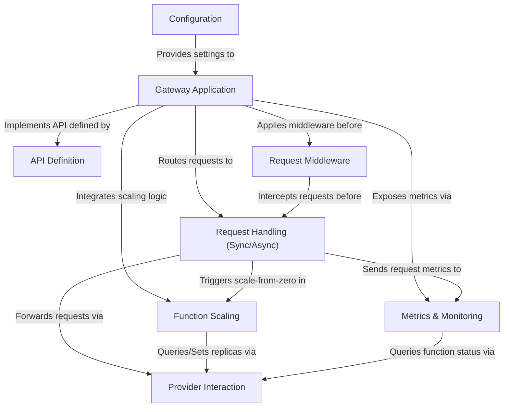

# Tutorial: OpenFaaS - Gateway Perspective

The OpenFaaS Gateway acts as the central entrypoint for the serverless platform.
It receives incoming HTTP requests, **routes** them to the appropriate **functions** (either *synchronously* or *asynchronously* via a queue), manages **function scaling** based on demand or alerts, interacts with the underlying **provider** (like Kubernetes) to deploy/manage functions, and exposes **metrics** and a defined **API** for platform management and monitoring. Configuration and middleware are applied to control its behavior and enhance request handling.

---

## Visual Overview

---

## Chapters

1. [Gateway Application](01_gateway_application_.md)
2. [Configuration](02_configuration_.md)
3. [API Definition](03_api_definition_.md)
4. [Request Middleware](04_request_middleware_.md)
5. [Request Handling (Sync/Async)](05_request_handling__sync_async__.md)
6. [Function Scaling](06_function_scaling_.md)
7. [Provider Interaction](07_provider_interaction_.md)
8. [Metrics & Monitoring](08_metrics___monitoring_.md)

---

Generated by [AI Codebase Knowledge Builder](https://github.com/The-Pocket/Tutorial-Codebase-Knowledge).
